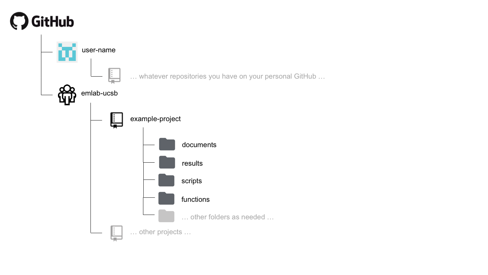

# File Structure

This section details emLab's organizational stucture for Google Docs/Sheets/Slides stored on Google Shared Drive, data and other file types stored emLab's GRIT data storage space (which we will simply refer to as "GRIT"), and code stored on GitHub.

**An important note**: while the file structures of our Google Shared Drive and GRIT storage spaces are similar, they contain fundamentally different types of files. For the Google Shared Drive, we should store *only* collaborate Google Docs/Sheets/Slides. For the GRIT data storage space, we should store everything else (e.g., data, media, Micorosft Office files, PDFs, etc)

## Folder Naming 

There are some general style conventions that should be used when naming folders. For any new folder, be descriptive but concise, avoid spaces, avoid uppercase (or camel-case), and avoid special characters other than `-`. Words should be separated with `-`, so an example folder name could be `blue-paradox-paper`. 

This folder naming convention should be used for any folder added to the Google Shared Drive, GRIT, or GitHub.

## Google Shared Drive

The Google Shared Drive and GRIT storage space share a very similar folder structure. The main difference is that the Google Shared Drive does not have any `data` folders, since all data is stored at GRIT. And of course, all files on Google Shared Drive are only collaborative Google Docs/Sheets/Slides. Everything else is stored at GRIT.

### General Structure

```
Google Drive
  |__ My Drive
  |   |__ ... whatever files you have on your personal Google Drive ...
  |__ Shared drives
      |__ emLab
          |__ central-emlab-resources
          |__ communications
          |__ projects
```

The emLab Google Shared Drive is organized into three main folders:

* `central-emlab-resources`: includes meeting and event information, project management guidelines, onboarding materials, information about travel reimbursements, strategy, computing, and the team roster

* `communications`: includes the blog schedule, publication and media tracking, and any Google Docs/Sheets/Slides relating to communications

* `projects`: includes information on  past (archive) and current projects

### Project Folder Structure

```
Google Drive
  |__ Shared drives
      |__ emLab
          |__ projects
              |__ archived-projects
              |__ current-project
              |   |__ example-project
              |   |   |__ deliverables
              |   |   |__ grant-eporting
              |   |   |__ meetings-and-events
              |   |   |__ presentations
              |   |   |__ project-materials
```

Each project folder must contain at least the following 5 folders:

* `deliverables`: final reports, paper manuscripts, other final deliverables not related to data outputs

* `grant-reporting`: grant reports for funders 

* `meetings-and-events`: meeting notes, agendas, documentation for workshop/event planning

* `presentations`: any presentations created for the project

* `project-materials`: everything else that does not fit into one of these folders (i.e. drafts of methods, literature review, etc.)

From here, each project can add additional folders or sub-folders as needed. Ensure that any folders or sub-folders you add to the project's Google Shared Drive folder are also added to the folder on GRIT, and vice versa.

## GRIT data storage space

Generally, the GRIT data storage space has a very similar structure to the Google Shared Drive, except it also has folders for `data`.

### General Structure

```
|__ emLab
  |__ central-emlab-resources
  |__ communications
  |__ data
  |__ projects
```

The emLab GRIT data directory is organized into five main folders:

* `central-emlab-resources`: includes meeting and event information, project management guidelines, onboarding materials, information about travel reimbursements, strategy, computing, and the team roster

* `communications`: includes the blog schedule, Adobe design projects, PowerPoint templates, photo repository, emLab logos, and publication and media tracking

* `data`: includes the centralized emLab data directory of the commonly used datasets we work with across projects (see Sections \@ref(emlab-data-directory-overview) and \@ref(emlab-data-directory) for more on this)

* `projects`: includes data and files on past (archive) and current projects

### Project Folder Structure

```
|__ emLab
  |__ projects
    |__ archived-projects
    |__ current-project
    |   |__ example-project
    |   |   |__ data
    |   |   |__ deliverables
    |   |   |__ grant-eporting
    |   |   |__ meetings-and-events
    |   |   |__ presentations
    |   |   |__ project-materials
```

Each project folder on GRIT must contain the following 6 folders:

* `data`: This data folder will contain a `data_overview` spreadsheet and all of the intermediate datasets as well as output datasets associated with the project (see Section \@ref(project-data-directory) for more on this). Be sure to also add a copy of your final datasets to the `emlab/data`data directory. 

* `deliverables`: final reports, paper manuscripts, other final deliverables not related to data outputs

* `grant-reporting`: grant reports for funders 

* `meetings-and-events`: meeting notes, agendas, documentation for workshop/event planning

* `presentations`: any presentations created for the project

* `project-materials`: everything else that does not fit into one of these folders (i.e. drafts of methods, literature review, etc.)

From here, each project can add additional folders or sub-folders as needed. Ensure that any folders or sub-folders you add to the project's Google Shared Drive folder are also added to the folder on GRIT, and vice versa.

### Data Directories

As stated above, there are two locations in which data can be stored. The two locations are both on GRIT, and are either: 1) project-specific data (e.g.,`emLab/current-projects/example-project/data`); or 2) the commonly used data shared across emLab projects (`emLab/data`) . This may seem confusing and redundant, but this section explains the differences between these two locations. As a short summary: `example-project/data` will contain all raw, cleaned, intermediate, and output data files for a given project, and will be used as the "workspace" while the project develops. On the other hand, `emlab/data` contains only (raw) input and output data from a finalized project. It therefore contains datasets that researchers envision may eventually be helpful to other researchers and that may be commonly used across multiple projects. More detail is provided in the subsequent sections.

#### `example-project/data`

**All** data used in a project should live in this project-specific repository. To help keep track of project data, we highly recommend creating and maintaining a `data_overview` Google sheet on the Google Shared Drive (see Section \@ref(project-data-directory) for more information). This overview spreadsheet will provide a centralized summary of the data inputs and outputs for a project, and also allow teams to keep track of the status of adding the data to the `emlab/data` folder and creating the necessary metadata documentation. This repository will typically contain subfolders for `raw`, `processed` (or `clean`), and `output`, although each team might make slight modifications to this structure to suit their needs.

To illustrate how each of these subfolders might be used, consider the following. A team may receive data from partners, extract data from external sources, compile survey responses, create a new dataset from a literature review, or use results from previous projects as input. These data are termed “raw data” and should never be directly modified - **all of the errors, mistakes, and gremlins should be kept in the original versions**. Instead, they should be processed / cleaned, and then exported as “clean data” that is actually used in analyses. The script used to do the processing / cleaning then acts as a reproducable record of everything that was done to the raw data. 

Suppose that a team working in Montserrat is tasked to perform a stock assessment on lobster populations and receives a database of lobster landings from the government. These data are stored as an excel spreadsheet, and will surely contain many mistakes that need to be fixed prior to running anly analyses. The team will clean the data (preferabily, using a reproducible script), and then export a new version of the data in which the mistakes have been fixed. The team will then perform the stock assessment, and produce results before reporting back. Therefore, the project-level data folder could be subdivided into `raw`, `clean`, and `output` folders. The first one will contain the excel file recieved from the government. The second folder will contain the cleaned data (perhaps exported as a csv), which can then be used as input for analyses within this project. The `output` folder will then contain the stock assessment results that might be relevant to other projects.

```
|__ emLab
  |__ projects
    |__ current-rojects
      |__ montserrat-project
      |   |__ Data
      |   |__ raw
      |   |   |__ lobster_landings_nov_2012.xslx
      |   |__ clean
      |   |   |__ lobster_landings_nov_2012.csv
      |   |__ output
      |       |__ lobster_stock_assessment.csv
```

As stated above, since the `output` folder could contain information relevant to other projects, this data should be made available to other emLab projects once the project is complete. To do this, any `output` data (and `raw` data if it is not already there) should be moved to the `emlab/data` folder, as described below.

#### `emlab/data` {#emlab-data-directory-overview}

As a general rule, this folder contains all data *used* and *produced* by emLab projects. The idea is to make it easier for people to find data that has been used in previous projects, as well as to use previous results as inputs for new projects. In other words, it is the place to store data that could be used commonly across multiple projects. Please see Section \@ref(#emlab-data-directory) for an overview of metadata that should be included with each dataset.

To illustrate types of data that should be in the `emlab/data` folder, consider the following. The [RAM Legacy stock assessment database](https://www.ramlegacy.org/) is key to many projects, and was used as input in the [Costello *et al.* 2016 "upsides" paper](https://www.pnas.org/content/113/18/5125). The "upsides database" is an output from the Costello paper, which has then been used as input for other projects. Therefore, the `emlab/data` folder contains separate folders for both the RAM and upsides datasets.

This large central data repository has the potential to become messy. Therefore, it is important to follow some key guidelines to store the data. **All datasets in this folder should be contained within their own folders that include at minimum the data and metadata files.** For example, a file structure for the two datasets mentioned above might be:

```
|__ emLab
  |__ data
    |__ upsides
    |   |__ _readme_upsides.txt   [the metadata]
    |   |__ upsides.csv           [the data]
    |__ ram
    |   |__ _readme_RAM.txt       [the metadata]
    |   |__ RAM v4.10             [the data]
    |   |__ RAM v4.15             [the data]
    |   |__ RAM v4.25             [the data]
    |   |__ RAM v4.40             [the data]
    |__ ... other data sets ...
```

In the above example, the folder containing the upsides database is relatively straightforward with the metadata file and a single csv file. However, the folder containing the RAM database is more complicated as this is a dataset that is re-released every so often as a new version. Specific guidelines for organizing different types of data within the `emlab/data` folder are discussed in detail in Section \@ref(data). 

## GitHub Structure

### Project Repository Structure

The structure of each emlab repository on GitHub will likely vary depending on the needs of the project, but the following structure is suggested as a starting point. 


<!-- ``` -->
<!-- Github -->
<!--   |__ emlab-ucsb [organization] -->
<!--       |__ example-project [repository] -->
<!--           |__ documents  -->
<!--           |__ results -->
<!--           |__ scripts -->
<!--           |__ functions -->
<!--           |__ ... other folders as needed... -->
<!-- ``` -->

A `documents` (or `docs`) folder may be useful for storing code files that are used to generate text-based documents or presentations. Types of files that might live here include things like markdown files. 

A `results` folder may be useful for storing plots or other types of results generated by the project. Some discretion needs to be used here, as some results may actually be considered to be "processed" or "output" data. However, results in the form of figures or workspace image files might live here. 

A `scripts` folder may be useful for storing the code files that do everything from processing the raw data to running the analysis and generating outputs. 

A `functions` folder may be useful for storing the code files in which functions that are used by many scripts many be stored. 

Different types of projects may require more or fewer folders and these are only meant to act as suggestions. Regardless, the structure of the repository should be sufficiently organized such that it can be easily navigated and understood by others by the time the project is completed. 

### A repo inside a repo

Sometimes, a project may have more than one paper or analysis sections. On some corner scenarios, we might want to have multiple "paper folders" within a "project folder". This would imply that we will have a repo inside a repo. If that is something that makes sense for you, your project, and your team, then `git submodules` are your solution. If you want to read more on when / how to use submodules, visit the [documentation page here](https://git-scm.com/book/en/v2/Git-Tools-Submodules).

Including submodules in your workflow is simple. Here's an example. you are working on a big project called "Blue Future". The project has six PIs, 13 Research Specialists, two PostDocs, and three PhD Students. After a long kick-off meeting, the team realizes that the project will produce two papers and a ShinyApp. You are all determined to keep everything on the same folder, but correctly categorized and organized. As such, you go to GitHub and create the following four repositories:

- Blue Future
- Paper 1
- Paper 2
- ShinyApp

You'll clone the Blue Future repo into your comuter, using the usual:

```
git clone https://github.com/emlab-ucsb/BlueFuture.git
```

Now, instead of cloning the repos for each paper and the app into their own folder, you'll navigate into your local BlueFuture folder. Then, instead of cloning them there, you can just do:

```
git submodule add https://github.com/emlab-ucsb/Paper1.git
```

This will clone the Paper 1 repo, but not without first telling the BlueFuture repo about it (just so that you don't end up tracking things twice). You can repeat the operation for `Paper2` and `ShinyApp`. That's it!


