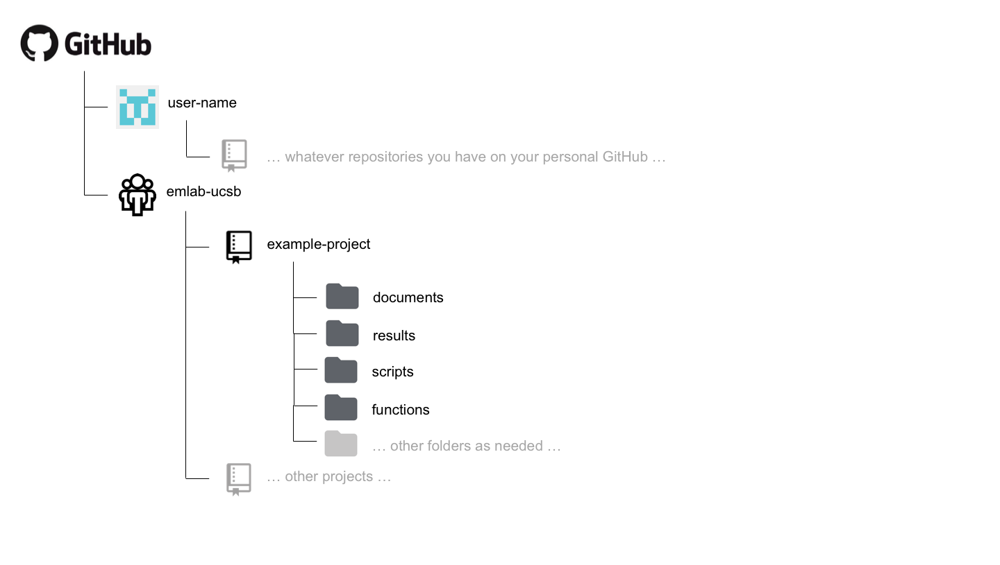

# GitHub Structure

## Project Repository Structure

The structure of each emlab repository on GitHub will likely vary
depending on the needs of the project, but the following structure is
suggested as a starting point.

 <!-- ``` --> <!-- Github -->
<!--   |__ emlab-ucsb [organization] -->
<!--       |__ example-project [repository] -->
<!--           |__ documents  --> <!--           |__ results -->
<!--           |__ scripts --> <!--           |__ functions -->
<!--           |__ ... other folders as needed... --> <!-- ``` -->

A `documents` (or `docs`) folder may be useful for storing code files
that are used to generate text-based documents or presentations. Types
of files that might live here include things like markdown files.

A `results` folder may be useful for storing plots or other types of
results generated by the project. Some discretion needs to be used here,
as some results may actually be considered to be "processed" or "output"
data. However, results in the form of figures or workspace image files
might live here.

A `scripts` folder may be useful for storing the code files that do
everything from processing the raw data to running the analysis and
generating outputs.

A `functions` folder may be useful for storing the code files in which
functions that are used by many scripts many be stored.

Different types of projects may require more or fewer folders and these
are only meant to act as suggestions. Regardless, the structure of the
repository should be sufficiently organized such that it can be easily
navigated and understood by others by the time the project is completed.

## A repo inside a repo

Sometimes, a project may have more than one paper or analysis sections.
On some corner scenarios, we might want to have multiple "paper folders"
within a "project folder". This would imply that we will have a repo
inside a repo. If that is something that makes sense for you, your
project, and your team, then `git submodules` are your solution. If you
want to read more on when / how to use submodules, visit the
[documentation page
here](https://git-scm.com/book/en/v2/Git-Tools-Submodules).

Including submodules in your workflow is simple. Here's an example. you
are working on a big project called "Blue Future". The project has six
PIs, 13 Research Specialists, two PostDocs, and three PhD Students.
After a long kick-off meeting, the team realizes that the project will
produce two papers and a ShinyApp. You are all determined to keep
everything on the same folder, but correctly categorized and organized.
As such, you go to GitHub and create the following four repositories:

-   Blue Future
-   Paper 1
-   Paper 2
-   ShinyApp

You'll clone the Blue Future repo into your comuter, using the usual:

```
git clone https://github.com/emlab-ucsb/BlueFuture.git
```

Now, instead of cloning the repos for each paper and the app into their
own folder, you'll navigate into your local BlueFuture folder. Then,
instead of cloning them there, you can just do:

```
git submodule add https://github.com/emlab-ucsb/Paper1.git
```

This will clone the Paper 1 repo, but not without first telling the
BlueFuture repo about it (just so that you don't end up tracking things
twice). You can repeat the operation for `Paper2` and `ShinyApp`. That's
it!
