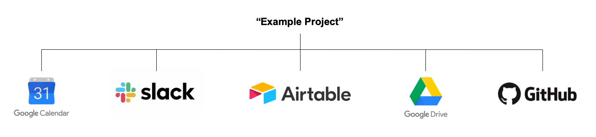
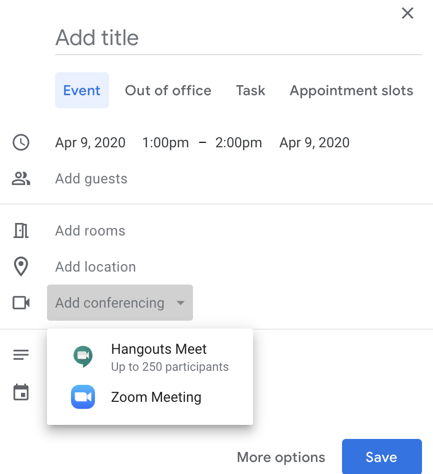
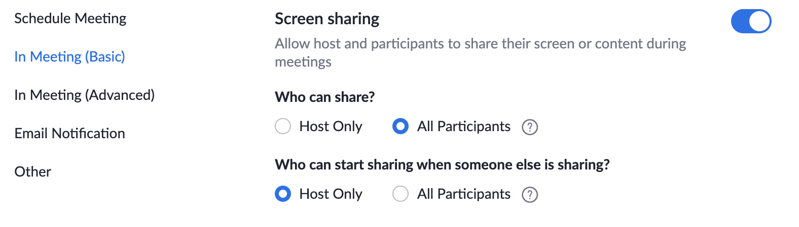
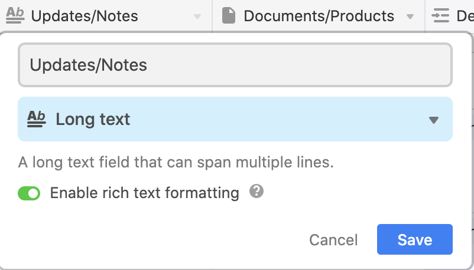
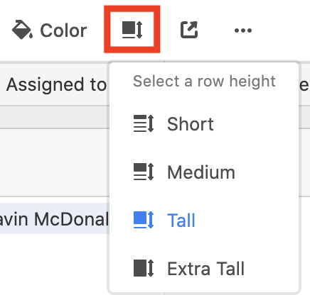
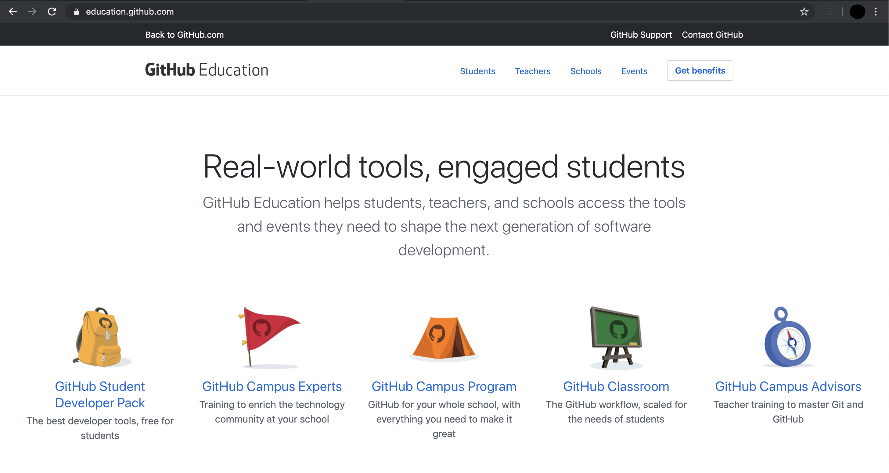
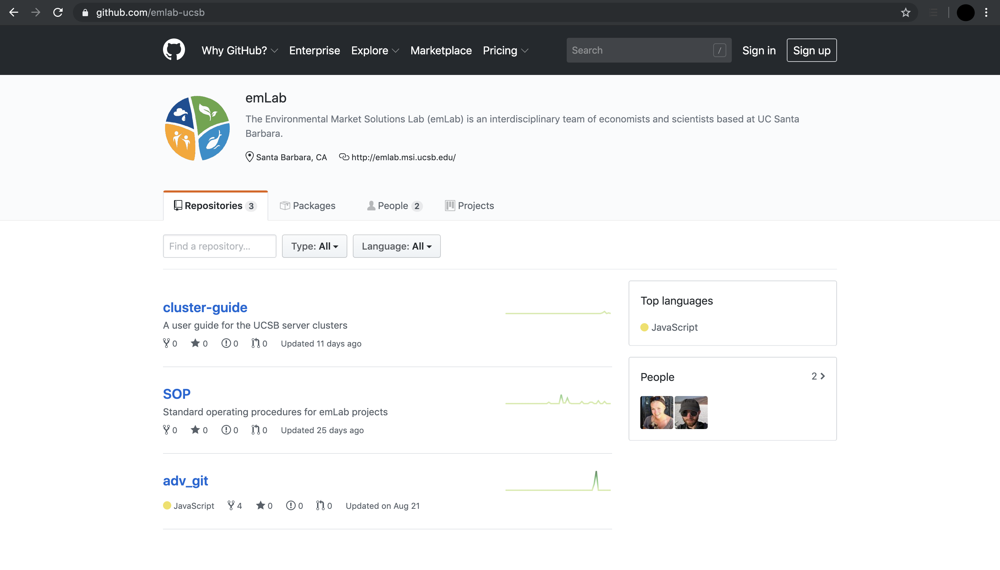
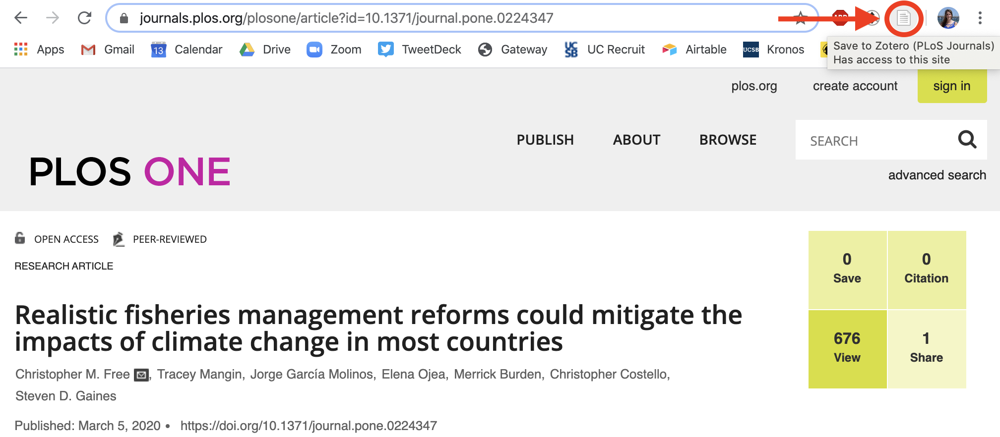
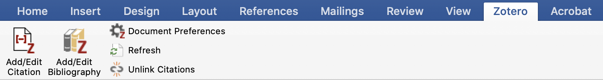

# Project Management

This section details the project management platforms we use at emLab to help set up projects for success. The first step for a new project will be to determine a common name to use across these platforms (note: name should be all lowercase with a dash separating words). Please additionally review the [project management best practices](https://docs.google.com/document/d/1DzlJktSw3LyN9gWNx0HIAlz_TyQDhyyPjXaWsWUuGSY/edit) document.



## Google Calendar

Our team relies heavily on Google Calendar to check team member’s availability and schedule meetings. Please keep your calendar up to date!

### Setting Out of Office Notifications

The best way to let people know if you are on vacation or out of the office is by setting up your calendar event as “Out of Office” instead of a regular event. You can customize this to automatically decline meetings on that day.

### Adding Other Calendars

To view team member’s calendars, click on the plus symbol next to “Other calendars” on the left hand side of your calendar and select “Subscribe to calendar.” There is a full list of team emails in the [emLab Team Roster](https://docs.google.com/spreadsheets/d/1hjFkcU68e7AMs-ueEYR82idqi3-dMJk-p1VRd5_YZV8/edit#gid=0) document. 

### Scheduling Rooms

See this [Room Scheduling](https://docs.google.com/document/d/18Caz3DMFJAN25Yo3vGXtRraMCA8Qt-qLaEGMv89WHUw/edit) document for full details on how to reserve rooms in both Bren and MSI. As a reminder, please add bren-sfg@ucsb.edu to the calendar invite for any meeting held in MSI 1304. 

## Zoom
Through UCSB, we have access to a paid Zoom account, which we use for all video conferencing. You can schedule a Zoom meeting (or recurring meetings) through your [browser](https://ucsb.zoom.us/) or the [Zoom app](https://zoom.us/download). Below are our Zoom best practices and guidelines. 

### Making Scheduling Easier

To make scheduling with Zoom easier, install [Zoom for GSuite](https://gsuite.google.com/marketplace/app/zoom_for_gsuite/364750910244). Once synced with your Zoom account, it will show up as an option along with Hangouts under conferencing when you create a calendar invite. Once created, you will also be able to see the meeting on your Zoom account.

{height="50%" width="50%"}

### Being an Effective Communicator on Zoom...

**...for meetings**

Here are a couple of tips for getting the most out of virtual meetings:

- __Everyone on video__: it’s nice to see everyone’s face instead of talking to black boxes. If your internet isn’t acting up, turn your video on to have a more engaging conversation. 

- __Sharing screens__: to keep everyone on the same page, have the presenter share their screen so all of the participants are looking at the same information to avoid any possible confusion. This is a good way to troubleshoot code, walk through documents, etc.

    - The new Zoom default is to only allow the host to screen share. To allow all participants to share their screens, go to your settings and under “who can share?” select “all participants.” 
  

    - Note: If you aren’t comfortable changing this setting, instead turn on the ability to have co-hosts and in the meeting select the screen-sharers to be co-hosts.

- __Whiteboard__: Zoom has a whiteboard feature that allows you to draw on your screen for everyone to see. To use this feature, share your screen and select “whiteboard” instead of a browser window. 

- __Nonverbal communication__: use the reactions feature in the bottom bar of your zoom meeting to react during a meeting (so far there is a clap and thumbs up option). You can also raise your hand in the meeting to signal that you have a question. To raise your hand, open the participant panel by clicking on participants in the lower bar and then click “raise hand” in the lower right hand corner (note: the host can’t raise their hand). 

- __Making the most of virtual meetings__:	

    - Circulate as much as possible (agenda, slides, google docs, etc.) before the meeting so people have time to read/review them 
  
    - If needed, schedule longer meetings to avoid feeling rushed and allow time to repeat things or deal with technical difficulties 
  
    - Notify people ASAP if they are cutting out
  
    - Dial-in and use phone for audio if your internet connection is poor 
  
    - Turn off videos if connection is poor

**...for lectures**

For teaching online courses, here are a couple additional tips. These are more geared towards keeping students engaged in a remote learning setting.

- __Zoom polls__: you can enable “polling” for meetings and develop a list of preset questions to ask the group. For example, after introducing a topic, you can have students do a practice problem and respond to the poll with their answer. Instructions on how to do this [here](https://support.zoom.us/hc/en-us/articles/213756303-Polling-for-Meetings).

- __Zoom whiteboard__: if you are used to drawing on the whiteboard in class, there is a virtual option for that through zoom! When sharing your screen, select whiteboard instead of your browser and draw away. 

- __Breakout rooms__: if your classes are more discussion-based, you can use the breakout room feature to break the class into smaller groups. The groups can either be automatically assigned randomly or manually assigned in specific groups ahead of time. More information on [breakout rooms](https://support.zoom.us/hc/en-us/articles/206476093) and [pre-assigning rooms](https://support.zoom.us/hc/en-us/articles/360032752671-Pre-assigning-participants-to-breakout-rooms). 

- __Record video__: record lectures and post them online for students to refer to later. You could also record yourself walking through a homework or test problem for them to reference.

- __Pause for questions__: since it will be harder to see students raise their hands, build in more breaks to pause for questions. You can also encourage students to either (1) add questions to the chat and pause once a couple of questions come in or (2) have them use the raise hand feature (see nonverbal communication above).  

### Avoiding Zoom Bombings

UCSB has developed guidelines for preventing Zoom bombing. emLab is not mandating any of these settings, these are just UCSB recommendations for making meetings more secure.

- Class-specific recommendations [here](https://keepteaching.id.ucsb.edu/wp-content/uploads/2020/04/Secure-Zoom-For-Classes-Cheat-Sheet-Graphics.pdf) 

- General information on securing Zoom [here](https://www.it.ucsb.edu/increasing-your-zoom-security) 

## Slack

Our team uses Slack on a daily basis to keep communication channels open within teams and across our different offices. We have an emLab workspace that houses all of our channels. When you are first added to Slack, you will be added to the General, Random, Communications, Report and Publications, and Code channels. We also have a channel for every project, which you will be added to as needed. You can view Slack either through a broswer window or by [downloading the desktop app](https://slack.com/help/categories/360000049043-getting-started).

### Slack Basics
Slack is organized into channels and direct messages. Channels are a way to organize conversations and other than a couple general emLab channels, are often project specific. Whatever you share in a channel is viewable by all members of that channel. You can also send direct messages to an individual or a group of up to 9 people. 

One great thing about Slack is that it’s searchable. You can search either by person or keywords to find old messages. Additionally, if someone sends you something you will need to reference multiple times, you can star messages and view them by clicking the star in the upper right-hand corner.

People have differing notification preferences, which you can set under Preferences → Notifications. If someone sends you a direct message or tags you, a number will show up on your slack app. If they add something to a channel you are on but don’t tag you, a red dot will show up. To ensure someone gets a numbered notification, either tag them (i.e. @Erin) or tag the channel (i.e. @channel). Tagging the channel will send a notification to every member of that channel.

### Creating a Channel
When a new project starts, create a slack channel for it and add the relevant team members to it. To create a channel, simply click on the plus symbol next to channels and fill out the channel information (Name, Purpose, and Send invites to). 

## Airtable

At emLab, we use [Airtable](https://airtable.com/) as our primary project management software for tracking project deliverables, activities, and roles. To put it simply, it’s a glorified spreadsheet that you can mold to fit your needs. Email Erin (eoreilly@ucsb.edu) to be added to Airtable. 

### Helpful Terminology

Base: think of it like a database. A base is made up of tabs of spreadsheets that can be customized and linked to one another.

Workspace: multiple bases can be organized within a workspace. For example, we have an emLab workspace and individual project bases. 

### Getting to Know the emLab Workspace

Within the emLab workspace, we have the following bases:

* emLab Projects and Pipeline
* Project Template
* Project-specific bases


The `emLab Projects and Pipeline` base contains overview information about current and potential projects. It is organized into the following tabs: Team Directory, Projects (current and archived), Deliverables (as outlined in the scope of work), and In the Pipeline (potential projects and their current stage). 

The `Project Template` provides the basic structure for a new project-specific base. It should be copied when starting a project base from scratch. 

Each emLab project has its own base. Teams can customize the number and content of the spreadsheets in their baseas they see fit, but at a minimum, must include the spreadsheets and columns specified in the `Project Template` base (see ‘required information’ below). *If you are working on a smaller project that does not require its own base, add it to the `Special Projects` base.*

### Customizing your Project Base

It is up to you and your team to determine how to make Airtable work for you. Outlined below are different ways to customize your base. Feel free to look at other bases for inspiration!

#### Required Information

To maintain transparency within the team and keep track of who is working on what to foster collaboration, all projects should keep their Airtable base up to date. 

The `Project Template` provides the basic structure for a project specific base. To copy, click on the arrow in the bottom right hand corner and select “duplicate base.” Then rename the base and customize it to the needs of your team.

The following tabs are required in your project base:

- Deliverables: all deliverables stated in the scope of work

    - Pro tip: add a number to the beginning of each deliverable so that when you group by deliverable in the activities tab, they show up in order instead of alphabetically 

- Activities: steps to achieve the deliverables. These are a level above individual tasks. For example if the deliverable is a report, an activity could be a literature review, and tasks would be specific components of the literature review. 

- Within the Activities tab, we employ a RACI chart to track responsibilities, which is broken into:

    - Responsible/Assigned to: who is responsible for doing the actual work for the task
  
    - Accountable: who is held accountable for the success of the task and is the decision maker
  
    - Consulted/Reviewer: who needs to be consulted for additional input or review 

    - Informed: who needs to be kept in the loop on project progress
  
- Team: list of team members with their project roles. This will be linked to the activities tab so you can see who is responsible and accountable for different activities. 

#### Additional Tab Ideas

- Tasks: more detailed steps of how to reach an activity; could be day-to-day tasks
    
    - Note: you can link a tasks tab with the activities tab to see how they feed into one another

- Datasets: way to keep track of all the datasets going into an analysis, if they have been collected, and what their priority is

    - Example
    

- Analyses: tracking different versions of a model run to keep track of progress and outputs of different simulations run

    - Example
    
    
- Murder board: tracking gaps in analysis

- On the back burner: bonus analysis that can be added on if there is extra time

- Stakeholders: tracking groups of stakeholders, what you want their feedback on, and when in the project you want their input

- Conferences and events: helps track potential conferences or events to present your work at

- Papers: if a project is planning to write multiple papers, dedicate a specific tab to tracking the papers and their progress

- Questions for PIs/team: place to keep track of unanswered questions 

  
#### Column Options

There are 25 column type options within Airtable. The ones we most commonly use are: link to another record (links information from different tabs within the same base; you can't link information across bases), single line text, long text, attachment, checkbox, multiple select, single select, and date.

*Pro tip: enable rich text formatting for the long text option to add checklists, bold and italic text, bullets, etc. Once enabled, double-click on the box you want to edit and select the ¶ symbol to see all of the formatting options.*

{height="50%" width="50%"}

#### Ways to View your Base

**Different views** 

There are 5 different ways to view your base: grid, calendar, gallery, kanaban, and form, which can be explored [here](https://airtable.com/product). 

*Pro tip: click on “Row Height” in the menu row to change the height of rows and therefore wrap text.*

{height="50%" width="50%"}

**Filtering**

This works like the normal filtering function in spreadsheets. You can sort A to Z, by date, exclude records with certain names, etc.

**Grouping**

Grouping allows you to bucket your spreadsheet by field type. You can group by deliverable, complete v. not complete, research track, etc.

Example: 


**Expanding a record**

Within each tab, you can expand records in the first column to view all its information at once by clicking the two opposing arrows before the text. This option combines information from all of the columns into an easy to read card format.


## Google Shared Drive

We have all experienced the moment where we can’t remember where a Google Doc is. To help solve this problem, we created an emLab Shared Google Drive, which is a centralized space for all of our documents to live within a shared file structure. Unlike files in My Drive (your personal Google Drive account), files within the Shared Drive belong to the team instead of an individual. So even if people leave, the files stay exactly where they are and aren’t lost with that person’s account. The structure of Shared Drive is detailed in Section 2. You can read more about Shared Drives [here](https://support.google.com/a/users/answer/9310351). 

### Sharing Files

Note: for Shared Drive, you either add someone to the entire Drive OR share individual files with them. **You cannot share folders within a Shared Drive with external collaborators.** 

Members of the Shared Drive can see all folders and files within the Drive. If you want to send a quick link to someone who is part of the Shared Drive, simply copy the URL from your browser. There is no need to create a shared link if you are sending it to someone with access to the emLab Shared Drive.

If you want to share files with people outside of the emLab Shared Drive, that is still possible. Within a document, click on Share in the upper right hand corner. From there are two options: either add people’s emails or create a shared link. 

### Linking the Shared Drive and your Computer

#### Why Install Drive File Stream?

As explained above, using a Shared Drive means that individuals don't "own" the files. All files are instead owned by the emLab Shared Drive, which lives "on the cloud". You can access these files through a web browser, just as you would access them on Google Drive. However, it is nice to have the files directly in your computer. To do so, you'll need to [install Drive File Stream](https://support.google.com/a/answer/7491144?hl=en), Google's new system that will partially replace Google Backup and Sync

There are important distinctions between **Backup and Sync** and **Drive File Stream**. As the names indicate it, **Backup and Sync** syncs and stores Drive content locally on your computer (that is, it takes up space in your hard drive). **Drive File Stream**, however *streams* all files and folders from the cloud. You can think of these as owning a DVD vs. streaming the movie from NetFlix. You can read more on the differences between these approaches [here](https://support.google.com/drive/answer/7638428?hl=en&ref_topic=6069785).

#### Step-by-step Installation

- Go to [Get started with Drive File Stream](https://support.google.com/drive/answer/7329379) and select the appropriate installer for your operating system.

    - Note: Make sure you are on your ucsb account


- If you are on a Windows machine, execute the `googledrivefilestream.exe` file. If you are on MacOS, run the `googledrivefilestream.dmg` file and then run the `GoogleDriveFileStream.pkg` file.

- Follow instruction on the helper (accept all defaults)

Once the installation is complete, you'll need to sign in to your account. To do so:

- Click on the Drive File Stream icon ()
    
    - On Windows machines, it should be on the bottom right corner of your screen
        
    - On MacOS, it should be at the top right of your screen

- Sign in with your ucsb account

- After signing in, the application will launch a short 4-screen overview of the product

- The last screen should look like the screenshot below. Click on the button to open your GoogleDrive folder and access your files


Once that finder / explorer opens, you should be able to see two folders: 1) `My Drive` and 2) `Shared drives`. The first folder will contain files owned by you (that is, your normal Google Drive Files stored on your ucsb account). The second folder will contain all shared drives you are part of. By navigating to that folder, you should see the emLab shared drive, containing all the folders mentioned earlier. A general structure of the GoogleDrive folder is shown below:

```
Google Drive
  |__ My Drive
  |   |__ Whatever files you have on your GoogleDrive
  |__ Shared drives
      |__ emlab
          |__central-emlab-resources
          |__communications
          |__data
          |__projects
          |__strategy
```

### Other Considerations

#### *Actual* location of the Google Drive folder on my computer

Remember that File Stream will *stream*, not save files to your computer. Therefore, there will be no folder directly under your devices / hard drives. Instead, your computer will detect the Google Drive folder as if it were an external device connected to your machine. On a Mac, the folder will therefore appear on your desktop, or under the `Devices` tab of your Finder. On a Windows machine, it will appear under `This PC`, next to your hard drive and any other connected devices.


#### I also want to link a personal gmail account

If you also want to sync files from your personal gmail account, you'll need to use Backup and Sync. You can install it, and make sure to sign in using your gmail account, not your ucsb account. Everything else should stay the same.

## Git and GitHub

Since most of our projects at emLab involve code, we use Git to track changes made to our code and faciliate collaboration by merging changes made by others, and GitHub to organize, share, and backup our code. 

This section provides a brief overview of how Git and Github work, how to install them on your computer (and how to join the emLab GitHub page), and some general guidelines for how to use GitHub to organize code associated with emLab projects. 

### What are Git and GitHub? 

Git is an open-source version control system designed for programmers. Git can operate as a standalone program on your computer, but can also operated through many other programs (or "clients"). GitHub (really github.com) is a hosting service that provides online storage for your Git-projects. Think of Git as a little creature that keeps a record of all of the changes made to a file stored on your computer, and GitHub as a safe place on the internet that the little creature can go and put a copy of that file (and the changes you've made) when you tell it to do so.  

There are a number of good tutorials with more information on how Git and GitHub work (as well as how you can set them up to sync directly through other programs such as RStudio). The [Ocean Health Index team at the National Center for Ecological Analysis and Synthesis (NCEAS)](https://www.nceas.ucsb.edu/ocean-health-index) here in Santa Barbara created a very detailed [data science training](http://ohi-science.org/data-science-training/) that includes two excellent tutorials on setting up and collaborating with GitHub:

- [GitHub](http://ohi-science.org/data-science-training/github.html)
- [Collaborating with GitHub](http://ohi-science.org/data-science-training/collaborating.html)

If you're new to using Git and GitHub, the two tutorials listed above are a great place to start since NCEAS and emLab often operate in a similar way. Additionally, see the Software Carpentry's lesson for the [Git novice](http://swcarpentry.github.io/git-novice/). If you primarily use (or will use) R for coding, Jenny Bryan also has an **excellent** tutorial specifically about how to integrate Git and GitHub with R:

- [Happy Git and GitHub for the useR](https://happygitwithr.com/)

If you're interested in learning more about all of the functionality GitHub has to offer, the [Openscapes team at NCEAS](https://www.openscapes.org/) has also tutorials on how to use GitHub for publishing code and for project management:

- [GitHub for Publishing](https://openscapes.github.io/series/github-pub.html)
- [GitHub for Project Management](https://openscapes.github.io/series/github-issues.html)

### Helpful Terminology

Git and GitHub use some weird terms that might be unfamiliar. Before installing and setting up Git and GitHub, here are a few key terms you may come across: 

- repository ("repo"): a collection of files pertaining to the same project, document, goal, etc. Generally there's a single repository for each project at emLab containing all of the code associated with that project. This repository can be organized with multiple folders and subfolders.  
- commit: a set of changes made by a user to one or more files in a repository that the user wants to prepare to send to GitHub.
- push: the action of sending a commit from your local machine to the remote GitHub directory. 
- pull: the action of retrieving any commits that have been made to the repository and are stored in the remote GitHub directory but are NOT on your local machine.

### How to Install Git and GitHub

Most of tutorials listed above include detailed instructions on how to install Git and GitHub. The short version (and steps specific to getting incorporated with the emLab GitHub page) are listed below. For more detailed instructions, please refer to the tutorials listed above. 

1. Create a free [GitHub](https://github.com/) account

- Notes:

    - use your @ucsb.edu email
    - make sure you remember your **username** and **password**, you'll need this later


Since GitHub is a company, and is used by many different types of organizations in many different industries, they offer a few different pricing schemes/deals. As an individual, once you create a username and sign up for an account, you get an unlimited number of free public and private repositories, but the number of external collaborators allowed in private repositories is limited to three. GitHub also offers a "Pro" plan for $7/month giving you  unlimited external collaborators on all of your private repositories. However, for students, faculty, and research staff, or official nonprofit organizations and charities GitHub waives this fee through its [GitHub Education](https://education.github.com/) and [GitHub for Good](https://github.com/nonprofit) programs. 

Good news! emLab qualifies as an educational organization through the GitHub Education program, and as a UCSB staff member you qualify for the individual educational discount. So, once you've signed up for a free account on GitHub... 

2. Go to the [GitHub Education](https://education.github.com/) page and register as a researcher (Note: this is why you should use your @ucsb.edu email for step 1).

 

Click on the "Get benefits" link in the top right-hand corner and follow the directions to upgrade your account to a "Pro" account for free. You may need to take a picture of your UCSB ID card to submit as part of this process. GitHub may also periodically ask you to re-verify your eligability to qualify for this program. 

3. Send Erin O'Reilly a Slack message (or an email if you must... eoreilly@ucsb.edu) with your new GitHub username so you can be added to the emLab GitHub page!

 

The emLab GitHub page is where the repositories for all emLab projects live (more on this later), and once you are a member of the organization you will be able to create new public and private repositories that appear here (as well as on your personal page). 

4. Install Git

If you're very very lucky, Git will already be installed on your computer. Open the shell for your opperating system. If you're using Mac OS X, this is called Terminal. If you're using Windows, you have multiple types of shells, but you should be using a **Git Bash** shell (NOT Power Shell). The easiest way to find out whether Git is already installed on your machine is to type the following: 

```{bash, eval = F}
git --version
## git version 2.20.1 (Apple Git-117)
```

If it returns a version number, you already have Git installed! However, if it returns something like `git: command not found`, you need to install Git. 

There are a number of different ways to install Git. Stand-alone installers exist for [Mac OS X](https://sourceforge.net/projects/git-osx-installer/files/) and [Windows](https://gitforwindows.org/). If you're using Linux, you probably already know how to install Git.  

If you're using Mac OS X, Git can also be installed as part of the XCode Command Line tools, or you can also install it using Homebrew. If you're interested in either of those options, follow the cooresponding directions in Jenny Bryan's tutorial. If that sentence doesn't mean anything to you, download the installer from the link above and follow the prompts.

Once you've installed Git via whichever method you've chosen for your operating system, open the shell again and retype the same command to verify that the installation was successful: 

```{bash, eval = F}
git --version
## git version 2.20.1 (Apple Git-117)
```

It should now return a version number.

5. Tell Git who you are

Git needs to know a little bit more about you in order to play nicely. In particular there are two things that it's helpful to configure: 1) The name that will be associated with any commits you make, and 2) the email address asssociated with your GitHub account. To set these two things, type the following into the shell using your name and email: 

```{bash, eval = F}
git config --global user.name 'Jane Doe'
git config --global user.email 'jane@example.com'
```

The user name input here should be your full name (i.e. it **does not** need to be the same as your username for GitHub), but the email **DOES** need to be the same as that associated with your GitHub account. 

You can then check to make sure these were entered correctly by typing: 

```{bash, eval = F}
git config --global --list
```

6. Optional: Store your credentials (so you don't have to type your password every time):

`Git` will sometimes want to make sure you are you when performing certain operations. For example, when cloning a private repo or when you want to push changes to a repo. If you don't want to do this every time, you can tell `Git` to remember your password too. You can read more about `Git`'s credential management [here](https://Git-scm.com/docs/gitcredentials).

On your terminal, navigate to a repository on your computer. (You can also use the Terminal pane within RStudio) and type the following into the shell:

```{bash, eval = F}
# Tell git to use the credential.helper
git config --global credential.helper store 
# git pull (or git push) will prompt you to enter your password
git pull
```

What we just did was to tell `Git` to store our credentials. So, after typing them this one time, you should not need to type it again.

7. Optional: Install a client for Git to make your life easier

If you actually tried step 6 and you're still reading this, you probably don't usually spend a lot of time running commands in the shell and the last step didn't make a lot of sense. If that's the case, you might want to also install a Git client in order to help you visualize what Git is actually doing. You do not need a Git client to take advantage of version-control functionality of Git, as everything can be done using the shell (as in the previous step). However, the shell is not user-friendly. 

There are a number of Git/GitHub clients that you can download to interact with Git and GitHub in a more visual way. 

If you use RStudio, there is a very basic Git client built in that may be enough to get you started (more on this later). Other nice free Git clients include:

- [GitKraken](https://www.gitkraken.com/) (available for all platforms, plus the logo octopus is pretty sweet...)
- [GitFiend](https://gitfiend.com/) (cross-platform)
- [SourceTree](https://www.sourcetreeapp.com/) (has some problems on Mac OS X)
- [GitHub Desktop](https://desktop.github.com/) (not available for Linux)
- [GitUp](https://gitup.co/) (only for Mac OS X)

There are many more. See Jenny Bryan's tutorial if you're not satisfied with those choices. 

Once you've installed a Git client, follow the directions to connect to your GitHub account. Once you've done this, try opening the local version of the repository you made in step 6, and notice the nice visual representation of the changes you made.

### General Guidelines for using GitHub at emLab

In general, each emLab project should have its own repository. There may be some cases in which multiple repositories may be associated with the same project, but this should be avoided if possible. The project repository should be created within the emLab GitHub page (exceptions may exist for example if a partner organization requires that the project repository be created within their organization's GitHub page). 

Repositories can be made public or private when they are created (depending on the nature of the project) while the project is ongoing, but should be made public when the project is complete. 

Since many previous (and ongoing) projects were created within the personal GitHub pages of emLab members, the ownership of these repositories should be transferred to the emLab GitHub page at the conclusion of the project if possible.

In order to ensure that the relevant researchers are notified of issues and other activities, researchers should "watch" or "subscribe" to repositories in which they work.

## Zotero

emLab uses Zotero to collaboratively collect, organize, and cite publications. We organize publications into Group Libraries which can be at the project or paper level. Our account – `emlab-ucsb` – has unlimited storage and there is no limit to the number of people you can add to a library. In Zotero, storage for a library only counts against the owner, so **the emLab account must be the owner of the library for access to unlimited storage.** 

### Making emLab the Owner of a Library

If creating a new group library, email Erin (eoreilly@ucsb.edu) and she can directly create the library under the emLab account. 

If you are the owner of an existing library and would like to transfer ownership to emLab, first invite `emlab-ucsb` to be a member of the library. Once that invitation has been accepted, then go to "Group Settings" for the library and in the bottom right of the page, select transfer ownership to the emLab account.

### Saving Publications to a Library

To use Zotero properly, you need to install the Zotero Connector for your browser in addition to the Zotero desktop app (see [this page for downloads](https://www.zotero.org/download/)). 

The most convenient way to save publications to Zotero is through Zotero Connector. The Zotero Connector allows you to add publications from your browser to Zotero with a single click. The “save” button shows up in the upper right corner of your browser and the symbol appears  differently depending on the type of reference you are viewing (e.g. book, PDF, webpage). After you click the save button, a popup will appear that allows you to select the library to save the reference to.



Read more about saving items to Zotero [here](https://www.zotero.org/support/adding_items_to_zotero). 

### Zotero Integration with GoogleDocs and Word

Zotero is a great resource for adding references to a manuscript. It is integrated into both [Word](https://www.zotero.org/support/word_processor_plugin_usage) and [GoogleDocs](https://www.zotero.org/support/google_docs) for easy use. As a note, you have to take extra steps to ensure that your references remain linked when switching between Word and GoogleDocs. See [this document](https://www.zotero.org/support/kb/moving_documents_between_word_processors) for more information about moving documents with Zotero citations between word processors.

#### Adding a Citation to your Document

In both Word and GoogleDocs, Zotero shows up as a separate tab/menu item for you to choose from. For example, this is the Zotero tab in Word.



To add an in-text citation, place your cursor after the statement you want to reference and then click on “Add/Edit Citation.” This brings up a Zotero search bar that allows you to search for a reference within your libraries based on a keyword or author. As you type, Zotero brings up options that you can select from. 


Once you select the citation, either insert a comma to add another citation or select enter to add the reference. 

Note: If you are adding a citation for the first time to a document, you will be asked to select the citation style. This allows you to add a reference style based on your target journal.


#### Adding a Bibliography to your Document

The most amazing thing about Zotero is that it automatically generates a bibliography for you based on your in-text citations. To add a bibliography, simply place your cursor where you want to add your reference list and select “Add/Edit Bibliography.” It will add all of the references for you based on the citation style selected. 
