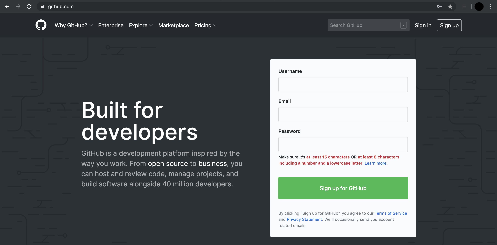

# Project Management

This section details the project management platforms we use at emLab to help set up projects for success. Please additionally review the [project management best practices](https://docs.google.com/document/d/1DzlJktSw3LyN9gWNx0HIAlz_TyQDhyyPjXaWsWUuGSY/edit) document.

## Google Calendar

Our team relies heavily on Google Calendar to check team member’s availability and schedule meetings. Please keep your calendar up to date!

### Setting out of office notifications

The best way to let people know if you are on vacation or out of the office is by setting up your calendar event as “Out of Office” instead of a regular event. You can customize this to automatically decline meetings on that day.

### Adding other calendars

To view team member’s calendars, click on the plus symbol next to “Other calendars” on the left hand side of your calendar and select “Subscribe to calendar.” There is a full list of team emails in the [emLab Team Roster](https://docs.google.com/spreadsheets/d/1hjFkcU68e7AMs-ueEYR82idqi3-dMJk-p1VRd5_YZV8/edit#gid=0) document. 

### Scheduling rooms

See this [Room Scheduling](https://docs.google.com/document/d/18Caz3DMFJAN25Yo3vGXtRraMCA8Qt-qLaEGMv89WHUw/edit) document for full details on how to reserve rooms in both Bren and MSI. As a reminder, please add bren-sfg@ucsb.edu to any meeting invite you want hold in MSI 1304. 

## Slack

Our team uses Slack on a daily basis to keep communication channels open within teams and across our different offices. We have an emLab work space that houses all of our channels. When you are first added to Slack, you will be added to the General, Random, Communications, Report and Publications, and Code channels. We also have a channel for every project, which you will be added to as needed. We recommend downloading the desktop app, but you can also view Slack in a browser window.

### Slack basics
Slack is organized into Channels and Direct Messages. Channels are a way to organize conversations and other than a couple general emLab channels, are often project specific. Whatever you share in a channel is viewable by all members of that channel. You can also send direct messages to an individual or a group of up to 9 people. 

One great thing about Slack is that it’s searchable. You can search either by person or keywords to find old messages. Additionally, if someone sends you something you will need to reference multiple times, you can star messages and view them by clicking the star in the upper right-hand corner.

People have differing notification preferences, which you can set under Preferences → Notifications. If someone sends you a direct message or tags you, a number will show up on your slack app. If they add something to a channel you are on but don’t tag you, a red dot will show up. To ensure someone gets a numbered notification (number is based on the number of messages), either tag them (i.e. @Erin) or tag the channel (i.e. @channel). Tagging the channel will send a notification to every member of that channel.

### Creating a channel
When a new project starts, create a slack channel for it and add the relevant team members to it. To create a channel, simply click on the plus symbol next to channels and fill out the channel information (Name, Purpose, and Send invites to). It’s that easy!

## Airtable

At emLab, we use Airtable as our primary project management software. To put it simply, it’s a glorified spreadsheet that you can mold to fit your needs. Email Erin (eoreilly@ucsb.edu) to be added to Airtable. 

### Helpful terminology

Base: think of it like a database. A base is made up of tabs of spreadsheets that can be customized and linked to one another

Workspace: multiple bases can be organized within a workspace. For example, we have an emLab workspace and individual project bases. 

### Getting to know the emLab workspace

Within the emLab workspace, we have the following bases:

* emLab projects and pipeline
* Project template
* Project specific

The emLab Projects and Pipeline base contains overview information about current and potential projects. It is organized into the following tabs: Team Directory, Projects (current and archived), Deliverables (as outlined in the scope of work), and In the Pipeline (potential projects and their current stage). 

The Project Template provides the basic structure for a project specific base. To copy, click on the arrow in the bottom right hand corner and select “duplicate base.” Then rename the base and customize it to the needs of your team. 

Each emLab project has its own base. Teams can customize these as they see fit, but at a minimum, please include the deliverables in the project’s scope of work and the team. Within the team tab, it is often helpful to add everyone’s project role because these might differ from project to project (i.e. might be a project manager on one and a researcher on another). 

### Customizing your project base

It is up to you and your team to determine how to make Airtable work for you. Outlined below are different ways to customize your base. Feel free to look at other bases that have been created for inspiration!

#### Tab ideas

* Deliverables (required): high level deliverables stated in the scope of work
* Tasks: more detailed steps of how to reach a deliverable; could be day-to-day tasks
  * Note: you can link a tasks tab with the deliverables tab to see how they feed into one another
* Team (required): list of team members with their emails and project role
  * Note: this can be linked to the deliverables and tasks tab so you know who is working on what
* Datasets: way to keep track of all the datasets going into an analysis and what stage of collection and processing they are in
  * Example: for the NatGeo Conservation Priorities project, they grouped data by goal (biodiversity, food provision, impacts, carbon), whether it had been collected, the stage of processing, data source, and description of the data
* Analyses: tracking different versions of a model run to keep track of progress and outputs of different simulations run
  * Example: for the NatGeo Conservation Priorities project, they listed each version and what was run in that version, and attached figures of the results
  
#### Column options

There are 25 column type options within Airtable. The ones we most commonly use are:

* Link to another record: links information from different tabs within the same base
  * Example: create an “assigned to” column in your deliverables tab and link it with your team tab. When looking at the deliverables tab, you can see how tasks are distributed across the team, and when looking at the team tab, you can see what deliverables each person is working on.
* Single line text
* Attachment
* Checkbox
* Multiple select
* Single select
* Date

#### Ways to view your base

**Different views** 

There are 5 different ways to view your base:

* Grid: view as a spreadsheet (most used!)
* Kanaban: view in columns (similar to Trello)
* Calendar: view items on a calendar
* Gallery: view each entry as its own card
* Form: creates something similar to a Google Form

You can also name different views of the same tab. For example, say you have a tasks tab and want to separately group them by deliverable and view what items are complete. Instead of manually changing this each time, create and name one view that groups by deliverable and then create and name another view that groups by completed. This way you can toggle back and forth with ease. 

**Filtering**

This works like the normal filtering function in spreadsheets. You can sort A to Z, by date, exclude records with certain names, etc.

**Grouping**

Grouping allows you to bucket your spreadsheet by field type. 

Example 1: Say you have a “Complete?” checkbox column. If you choose to group by “Complete?” it will place all records with the box checked in one bucket and all records that aren’t checked in another bucket. 

Example 2: For the clean seafood project, there are four different research tracks and general items for the team to complete. If you create a “Research Track” column with a drop-down of the different tracks and group by track, you can view deliverables separated out by research track. 
Expanding record
Within each tab, you can expand records in the first column to view all its information at once by clicking the two opposing arrows before the text. This option combines information from all of the columns into an easy to read card format.

## Google Shared Drive

We have all experienced the moment where we can’t remember where a Google Doc is. To help solve this problem, we created an emLab Shared Google Drive, which is a centralized space for all of our documents to live within a shared file structure. Unlike files in My Drive (your personal Google Drive account), files within the Shared Drive belong to the team instead of an individual. So even if people leave, the files stay exactly where they are and aren’t lost with that person’s account. You can read more about Shared Drives [here](https://support.google.com/a/users/answer/9310351). 

### General structure

The emLab Shared Drive is organized into four main folders:

* Central emLab Resources: includes meeting and event information, onboarding materials, information about travel reimbursements, and the team roster
* Communications: includes the blog schedule, Adobe design projects, PowerPoint templates, photo repository, and publication and media tracking
* Data: will include the emLab data directory and all datasets we work with
* Projects: includes information on past and current projects, and project management guidelines

A full table of contents can be seen [here](https://docs.google.com/document/d/1a26a6N4akF2dSXWfp0fWxGegd0wvrPVUeaA09en2EPE/edit). 

Each project folder must contain the following 5 folders:

* Deliverables
* Grant Reporting
* Meetings and Events
* Presentations
* Project Materials

From here, each project can add sub-folders as they see fit.

### Sharing files

Note: for Shared Drive, you either add someone to the entire Drive or share individual files with them. **You cannot share individual folders within a Shared Drive.** 

Members of the Shared Drive can see all folders and files within the Drive. If you want to send a quick link to someone who is part of the Shared Drive, simply copy the URL from your browser. There is no need to create a shared link if you are sending it to someone with access to the emLab Shared Drive.

If you want to share files with people outside of the emLab Shared Drive, that is still possible. Within a document, click on Share in the upper right hand corner. From there are two options: either add people’s emails or create a shared link. To create a shared link, click Who Has Access and turn link sharing on. From there you can select the level of editing capabilities and either keep the just UCSB access or expand to allow external access. 

### How to install locally (Juan Carlos)

* *Background of why people would want to install drive file stream*
* *Include both simple instructions and instructions of how to deal with mounting 2 different accounts*

## Git and GitHub

Since most of our projects at emLab involve code, we use Git to track changes made to our code and faciliate collaboration by merging changes made by others, and GitHub to organize, share, and backup our code. 

This section provides a brief overview of how Git and Github work, how to install them on your computer (and how to join the emLab GitHub page), and some general guidelines for how to use GitHub to organizing code associated with emLab projects. 

### What are Git and GitHub? 

Git is an open-source version control system designed for programmers. Git can operate as a standalone program on your computer, but can also operated through many other programs (or "clients"). GitHub (really github.com) is a hosting service that provides online storage for your Git-projects. Think of Git as a little creature that keeps a record of all of the changes made to a file stored on your computer, and GitHub as a safe place on the internet that the little creature can go and put a copy of that file (and the changes you've made) when you tell it to do so.  

There are a number of good tutorials with more information on how Git and GitHub work (as well as how you can set them up to sync directly through other programs such as RStudio). The [Ocean Health Index team at the National Center for Ecological Analysis and Synthesis (NCEAS)](https://www.nceas.ucsb.edu/ocean-health-index) here in Santa Barbara created a very detailed [data science training](http://ohi-science.org/data-science-training/) that includes two excellent tutorials on setting up and collaborating with GitHub: 
- [GitHub](http://ohi-science.org/data-science-training/github.html)
- [Collaborating with GitHub](http://ohi-science.org/data-science-training/collaborating.html)

If you're new to using Git and GitHub, the two tutorials listed above are a great place to start since NCEAS and emLab often operate in a similar way. If you primarily use (or will use) R for coding, Jenny Bryan also has an **excellent** tutorial specifically about how to integrate Git and GitHub with R: 
- [Happy Git and GitHub for the useR](https://happygitwithr.com/)

If you're interested in learning more about all of the functionality GitHub has to offer, the [Openscapes team at NCEAS](https://www.openscapes.org/) has also tutorials on how to use GitHub for publishing code and for project management:
- [GitHub for Publishing](https://openscapes.github.io/series/github-pub.html)
- [GitHub for Project Management](https://openscapes.github.io/series/github-issues.html)

### Helpful terminology

Git and GitHub use some wierd terms that might be unfamilar. Before installing and setting up Git and GitHub, here are a few key terms you may come across: 

- repository ("repo"): a collection of files pertaining to the same project, document, goal, etc. Generally there's a single repository for each project at emLab containing all of the code associated with that project. This repository can be organized with multiple folders and subfolders.  
- commit: a set of changes made by a user to one or more files in a repository that the user wants to prepare to send to GitHub.
- push: the action of sending a commit from your local machine to the remote GitHub directory. 
- pull: the action of retrieving any commits that have been made to the repository and are stored in the remote GitHub directory but are NOT on your local machine.

### How to install Git and Github

Most of tutorials listed above include detailed instructions on how to install Git and Github. The short version (and steps specific to getting incorporated with the emLab GitHub page) are listed below. For more detailed instructions, please refer to the tutorials listed above. 

1. Create a free [GitHub](https://github.com/) account (Note: use your @ucsb.edu email!). 



Since GitHub is a company, and is used by many different types of organizations in many different industries, they offer a few different pricing schemes/deals. As an individual, once you create a username and sign up for an account, you get an unlimited number of free public and private repositories, but the number of external collaborators allowed in private repositories is limited to three. GitHub also offers a "Pro" plan for $7/month giving you  unlimited external collaborators on all of your private repositories. However, for students, faculty, and research staff, or official nonprofit organizations and charities GitHub waives this fee through its [GitHub Education](https://education.github.com/) and [GitHub for Good](https://github.com/nonprofit) programs. 

Good news! emLab qualifies as an edcuational organization through the GitHub Education program, and as a UCSB staff member you qualify for the individual educational discount. So, once you've signed up for a free account on GitHub... 

2. Go to the [GitHub Education](https://education.github.com/) page and register as a researcher (Note: this is why you should use your @ucsb.edu email for step 1).

 

Click on the "Get benefits" link in the top right-hand corner and follow the directions to upgrade your account to a "Pro" account for free. You may need to take a picture of your UCSB ID card to submit as part of this process. GitHub may also periodically ask you to re-verify your eligability to qualify for this program. 

3. Send Darcy Bradley a Slack message (or an email if you must... darcybradley@ucsb.edu) with your new GitHub username so you can be added to the emLab GitHub page!

 

The emLab GitHub page is where the repositories for all emLab projects live (more on this later), and once you are a member of the organization you will be able to create new public and private repositories that appear here (as well as on your personal page). 

4. Install Git

If you're very very lucky, Git will already be installed on your computer. Open the shell for your opperating system. If you're using Mac OS X, this is called Terminal. If you're using Windows, you have multiple types of shells, but you should be using a **Git Bash** shell (NOT Power Shell). The easiest way to find out whether Git is already installed on your machine is to type the following: 

```{bash, eval = F}
git --version
## git version 2.20.1 (Apple Git-117)
```

If it returns a version number, you already have Git installed! However, if it returns something like `git: command not found`, you need to install Git. 

There are a number of different ways to install Git. Stand-alone installers exist for [Mac OS X](https://sourceforge.net/projects/git-osx-installer/files/) and [Windows](https://gitforwindows.org/). If you're using Linux, you probably already know how to install Git.  

If you're using Mac OS X, Git can also be installed as part of the XCode Command Line tools, or you can also install it using Homebrew. If you're interested in either of those options, follow the cooresponding directions in Jenny Bryan's tutorial. If that sentence doesn't mean anything to you, download the installer from the link above and follow the prompts.

Once you've installed Git via whichever method you've chosen for your operating system, open the shell again and retype the same command to verify that the installation was successful: 

```{bash, eval = F}
git --version
## git version 2.20.1 (Apple Git-117)
```

It should now return a version number.

5. Tell Git who you are

Git needs to know a little bit more about you in order to play nicely. In particular there are two things that it's helpful to configure: 1) The name that will be associated with any commits you make, and 2) the email address asssociated with your GitHub account. To set these two things, type the following into the shell: 

```{bash, eval = F}
git config --global user.name 'Jane Doe'
git config --global user.email 'jane@example.com'
```

using your name and email. The user name input here should be your full name (i.e. it **does not** need to be the same as your username for GitHub), but the email **DOES** need to be the same as that associated with your GitHub account. 

You can then check to make sure these were entered correctly by typing: 

```{bash, eval = F}
git config --global --list
```

6. Optional: Make a repository on GitHub and practice connecting to it

[Do a practice example here].

7. Optional: Instal a client for Git to make your life easier

If you actually tried step 6 and you're still reading this, you probably don't usually spend a lot of time running commands in the shell and the last step didn't make a lot of sense. If that's the case, you might want to also install a Git client in order to help you visualize what Git is actually doing. You do not need a Git client to take advantage of version-control functionality of Git, as everything can be done using the shell (as in the previous step). However, the shell is not user-friendly. 

There are a number of Git/GitHub clients that you can download to interact with Git and GitHub in a more visual way. 

If you use RStudio, there is a very basic Git client built in that may be enough to get you started (more on this later). Other nice free Git clients include: 
- [GitKraken](https://www.gitkraken.com/) (available for all platforms, plus the logo octopus is pretty sweet...)
- [SourceTree](https://www.sourcetreeapp.com/) (has some problems on Mac OS X)
- [GitHub Desktop](https://desktop.github.com/) (not available for Linux)
- [GitUp](https://gitup.co/) (only for Mac OS X)

There are many more. See Jenny Bryan's tutorial if you're not satisfied with those choices. 

One you've installed a Git client, follow the directions to connect to your GitHub account. Once you've done this, try opening the local version of the repository you made in step 6, and notice the nice visual representation of the changes you made.

### Some general guidelines for using GitHub at emLab


