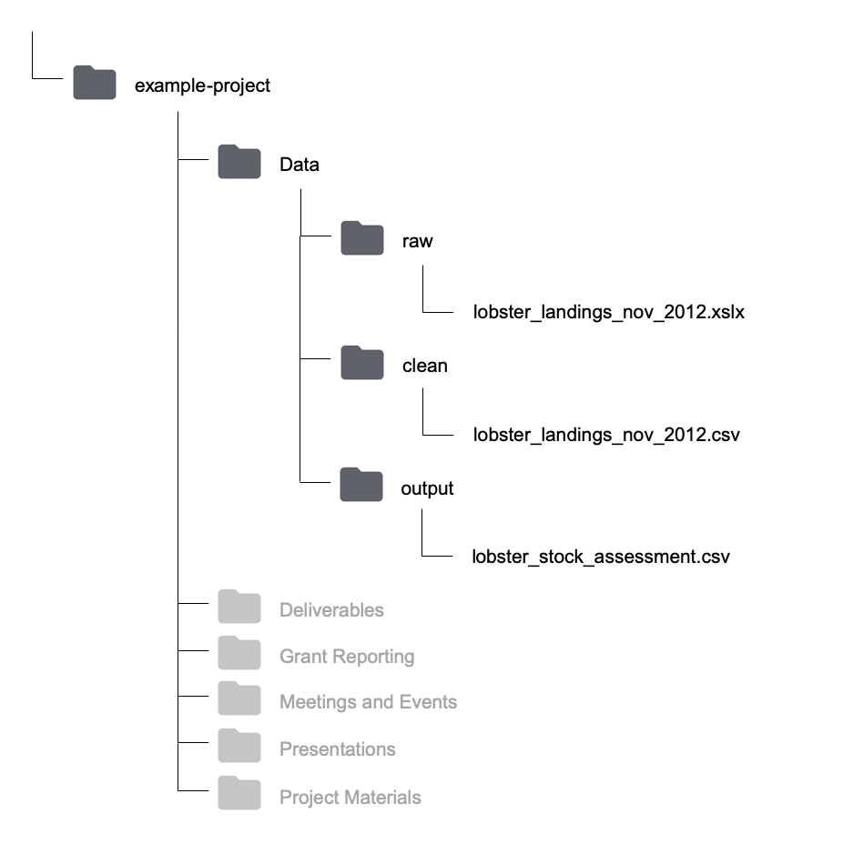
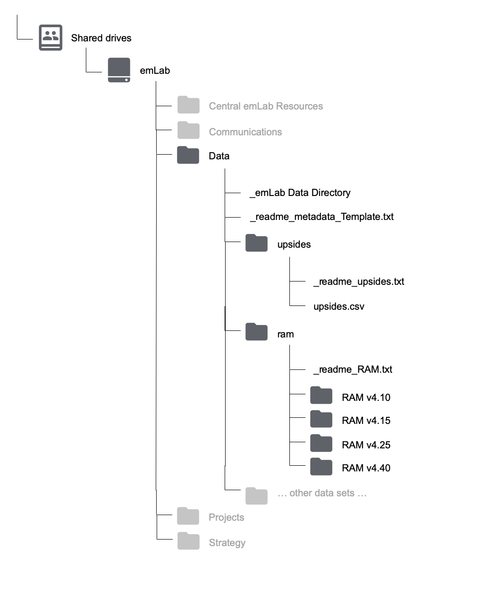

# File Structure

This section details the emLab's organizational stucture for files and data stored on Google Drive and code stored on Github.

## Folder Naming 

There are some general style conventions that should be used when naming folders relating to **data** storage on the emLab Google Shared Drive, and **code** storage on Github. When naming these folders, be desciptive but concise, avoid spaces, avoid uppercase (or camel-case), and avoid special characters other than `-`. Words should be separated with `-`, so an example folder name could be `blue-paradox-paper`. 

Note: while this style should be used for all folders relating to data and code storage, it is not required for other types of file storage on the emLab Shared Drive. 

## Shared Drive Files

### General Structure


<!-- ``` -->
<!-- Google Drive -->
<!--   |__ My Drive -->
<!--   |   |__ ... whatever files you have on your Google Drive ... -->
<!--   |__ Shared drives -->
<!--       |__ emLab -->
<!--           |__ Central emLab Resources -->
<!--           |__ Communications -->
<!--           |__ Data -->
<!--           |__ Projects -->
<!--           |__ Strategy -->
<!-- ``` -->

The emLab Shared Drive is organized into five main folders:

* Central emLab Resources: includes meeting and event information, onboarding materials, information about travel reimbursements, and the team roster

* Communications: includes the blog schedule, Adobe design projects, PowerPoint templates, photo repository, and publication and media tracking

* Data: includes the emLab data directory and all datasets we work with (see section 2.2.3 for more on this)

* Projects: includes information on past and current projects, and project management guidelines

* Strategy

A full table of contents can be seen [here](https://docs.google.com/document/d/1a26a6N4akF2dSXWfp0fWxGegd0wvrPVUeaA09en2EPE/edit). 

### Project Folder Structure


<!-- ``` -->
<!-- Google Drive -->
<!--   |__ Shared drives -->
<!--       |__ emLab -->
<!--           |__ Projects -->
<!--               |__ Archived Projects -->
<!--               |__ Current Projects -->
<!--               |   |__ example-project -->
<!--               |   |   |__ Data -->
<!--               |   |   |__ Deliverables -->
<!--               |   |   |__ Grant Reporting -->
<!--               |   |   |__ Meetings and Events -->
<!--               |   |   |__ Presentations -->
<!--               |   |   |__ Project Materials -->
<!--               |   |__ ... other projects ... -->
<!--               |__ Project Management Resources -->
<!--               |__ Scoping -->
<!-- ``` -->

Each project folder must contain the following 6 folders:

* Data: This data folder will contain all of the intermediate datasets as well as output datasets associated with the project (see section 2.2.3 for more on this). Be sure to also add a copy of your final datasets to the `emLab/Data` folder and data directory. 

* Deliverables: final reports, paper manuscripts, other final deliverables not related to data outputs

* Grant Reporting: grant reports for funders 

* Meetings and Events: meeting notes, agendas, documentation for workshop/event planning

* Presentations: any presentations created for the project

* Project Materials: everything else that does not fit into one of these folders (i.e. drafts of methods, literature review, etc.)

From here, each project can add sub-folders as they see fit within these 6 folders.

### Data Storage

As stated above, there are two locations in which data can be stored. The two locations are `Google Drive/Shared drives/emLab/Projects/example-project/Data` and `Google Drive/Shared drives/emLab/Data`. This may seem confusing and redundant, but this section explains the differences between these two locations. As a short summary: `example-project/Data` may contain raw, cleaned, intermediate, and output files for a given project, and will be used as the "workspace" while the project develops. On the other hand, `example-project/Data` contains only (raw) input and output data from a finalized project. More detail is provided in the subsequent sections.

#### `example-project/Data`

**All** data used in a project should live in this project-specific repository. This repository will typically contain subfolders for `raw`, `processed` (or `clean`), and `output`, although each team might make slight modifications to this structure as it suits their needs.

To illustrate how each of these subfolders might be used, consider the following. A team may receive data from partners, extract data from external sources, compile survey responses, create a new dataset from a literature review, or use results from previous projects as input. These data are termed “raw data”, and should never be directly modified - **all of the errors, mistakes, and gremlins should be kept in the original versions**. Instead, they should be processed / cleaned, and then exported as “clean data”, that is actually used in analyses. The script used to do the processing / cleaning then acts as a reproducable record of everything that was done to the raw data. 

Suppose that a team working in Montserrat is tasked to perform a stock assessment on lobster populations and receives a database of lobster landings from the government. These data are stored as an excel spreadsheet, and will surely contain many mistakes that need to be fixed prior to running anly analyses. The team will clean the data (preferabily, using a reproducible script), and then export a new version of the data in which the mistakes have been fixed. The team will then perform the stock assessment, and produce results before reporting back. Therefore, the project-level data folder could be subdivided into `raw`, `clean`, and `output` folders. The first one will contain the excel file recieved from the government. The second folder will contain the cleaned data (perhaps exported as a csv), which can then be used as input for analyses within this project. The `output` folder will then contain the stock assessment results that might be relevant to other projects.



<!-- ``` -->
<!-- Projects -->
<!-- |__ Current Projects -->
<!--     |__ montserrat-project -->
<!--     |   |__ Data -->
<!--     |   |__ raw -->
<!--     |   |   |__ lobster_landings_nov_2012.xslx -->
<!--     |   |__ clean -->
<!--     |   |   |__ lobster_landings_nov_2012.csv -->
<!--     |   |__ output -->
<!--     |       |__ lobster_stock_assessment.csv -->
<!--     |__ ... other projects ...      -->

<!-- ``` -->

As stated above, since the `output` folder could contain information relevant to other projects, this data should be made available to other emLab projects once the project is complete. To do this, any `output` data (and `raw` data if it is not already there) should be moved to the `emLab/Data` folder, as described below.

#### `emLab/Data`

As a general rule, this folder contains all data *used* and *produced* by emLab projects. The idea is to make it easier for people to find data that has been used in previous projects, as well as to use previous results as inputs for new projects.

To illustrate types of data that should be in the `emLab/Data` folder, consider the following. The [RAM Legacy stock assessment database](https://www.ramlegacy.org/) is key to many projects, and was used as input in the [Costello *et al.* 2016 "upsides" paper](https://www.pnas.org/content/113/18/5125). The "upsides database" is an output from the Costello paper, which has then been used as input for other projects. Therefore, the `emLab/Data` folder contains both the RAM and upsides datasets.

This large central data repository has the potential to become messy. Therefore, it is important to follow some key guidelines to store the data. All datasets in this folder should be contained within their own folders that include at minimum the data and metadata files. For example, a file structure for the two datasets mentioned above might be:



<!-- ``` -->
<!-- emLab -->
<!--   |__ ...                            [other folders] -->
<!--   |__ Data -->
<!--        |__ upsides -->
<!--        |   |__ _readme_upsides.txt   [the metadata] -->
<!--        |   |__ upsides.csv           [the data] -->
<!--        |__ ram -->
<!--        |   |__ _readme_RAM.txt       [the metadata] -->
<!--        |   |__ RAM v4.10             [the data] -->
<!--        |   |__ RAM v4.15             [the data] -->
<!--        |   |__ RAM v4.25             [the data] -->
<!--        |   |__ RAM v4.40             [the data] -->
<!--        |__ ... other data sets ...             -->
<!-- ``` -->

In the above example, the folder containing the upsides database is relatively straightforward with the metadata file and a single csv file. However, the folder containing the RAM database is more complicated as this is a dataset that is re-released every so often as a new version. Specific guidelines for organizing different types of data within the `emLab/Data` folder are discussed in detail in section 3. 

## GitHub Structure

### Project Repository Structure

The structure of each emlab repository on GitHub will likely vary depending on the needs of the project, but the following structure is suggested as a starting point. 


<!-- ``` -->
<!-- Github -->
<!--   |__ emlab-ucsb [organization] -->
<!--       |__ example-project [repository] -->
<!--           |__ documents  -->
<!--           |__ results -->
<!--           |__ scripts -->
<!--           |__ functions -->
<!--           |__ ... other folders as needed... -->
<!-- ``` -->

A `documents` (or `docs`) folder may be useful for storing code files that are used to generate text-based documents or presentations. Types of files that might live here include things like markdown files. 

A `results` folder may be useful for storing plots or other types of results generated by the project. Some discretion needs to be used here, as some results may actually be considered to be "processed" or "output" data. However, results in the form of figures or workspace image files might live here. 

A `scripts` folder may be useful for storing the code files that do everything from processing the raw data to running the analysis and generating outputs. 

A `functions` folder may be useful for storing the code files in which functions that are used by many scripts many be stored. 

Different types of projects may require more or fewer folders and these are only meant to act as suggestions. Regardless, the structure of the repository should be sufficiently organized such that it can be easily navigated and understood by others by the time the project is completed. 

