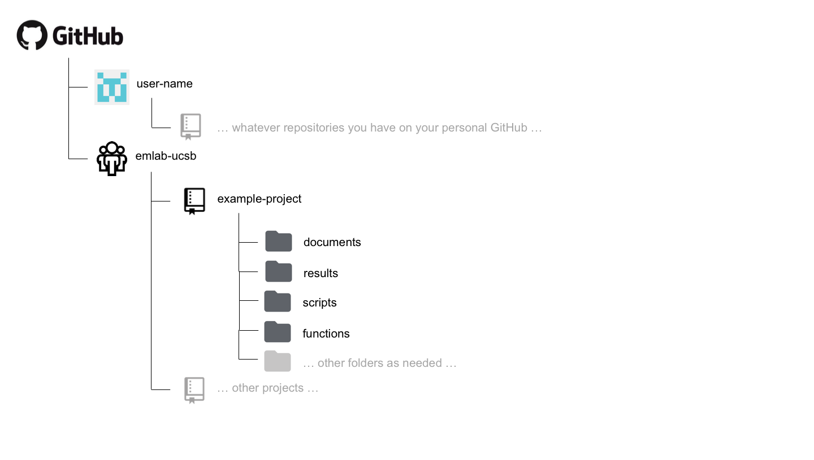

# Repository organization

A well-organized repository should allow someone new to the project to quickly use the file structure and README to understand what the project does, what data it uses, where the analysis code lives, and how to reproduce the outputs. This section describes how to structure a repository and how to write a README that serves that purpose.

## Creating a repository

All emLab projects must have a repository under the [emlab-ucsb](https://github.com/emlab-ucsb) GitHub organization. To create one, navigate to the organization page, click **New repository**, and fill in:

- **Repository name:** Use `kebab-case` with a short, descriptive name (e.g., `tuna-mse`, `kelp-carbon-stock`).
- **Visibility:** Set to **Private** unless the project is explicitly intended to be public from the start.
- **Initialize with a README:** Check this box. It creates a default branch and gives you something to edit immediately.
- **.gitignore:** Select the appropriate template for your primary language (R, Python, etc.). This prevents common generated files (e.g., `.Rhistory`, `__pycache__/`) from being tracked.

## Repository structure

There is no single correct directory structure, and the right organization depends on the nature of the project. What matters is that the structure is logical, consistent within the project, and communicated in the README.

 <!-- ``` --> <!-- Github -->
<!--   |__ emlab-ucsb [organization] -->
<!--       |__ example-project [repository] -->
<!--           |__ documents  --> <!--           |__ results -->
<!--           |__ scripts --> <!--           |__ functions -->
<!--           |__ ... other folders as needed... --> <!-- ``` -->

A `documents` (or `docs`) folder may be useful for storing code files
that are used to generate text-based documents or presentations. Types
of files that might live here include things like markdown files.

A `results` folder may be useful for storing plots or other types of
results generated by the project. Some discretion needs to be used here,
as some results may actually be considered to be "processed" or "output"
data. However, results in the form of figures or workspace image files
might live here.

A `scripts` folder may be useful for storing the code files that do
everything from processing the raw data to running the analysis and
generating outputs.

A `functions` folder may be useful for storing the code files in which
functions that are used by many scripts many be stored.

Different types of projects may require more or fewer folders and these
are only meant to act as suggestions. Regardless, the structure of the
repository should be sufficiently organized such that it can be easily
navigated and understood by others
An R project that uses `targets` for pipeline management might have a slightly different structure, with an R/ directory for functions and a _targets.R file at the root that defines the workflow. 

## Organization principles

A few principles apply for any project, regardless of the specific structure:

1. **Raw data is read-only.** The `data/raw/` directory should contain data exactly as it came from its source. Scripts should never write to this directory. This makes it possible to re-run the entire pipeline from scratch and to verify that nothing was silently altered.

2. **Number scripts in execution order.** If your analysis has a defined sequence, prefix script names with numbers (`01_`, `02_`, etc.). This makes the pipeline legible at a glance.

3. **Large data files do not belong in git.** Git is designed for text files, not large binary or data files. If your project uses large datasets (i.e., any file that is >100MB), they should live on a shared drive (e.g., [emLab's UCSB Nextcloud storage space managed by GRIT](https://emlab-ucsb.github.io/emlab-manual/emlab-workflow-and-platforms.html#nextcloud-and-the-emlab-server)) and be referenced by path in the code, not committed to the repository. Document where the data lives in the README.

An important note is that most emLab projects read and write data to our GRIT storage space and don't store data within the GitHub repository itself. The repository should contain code and documentation, not the data the code operates on. Document where the data lives in the README and reference it by path in the code.

The main exception is when a repository is being prepared for public release alongside a publication. In that case, including small, analysis-ready data files directly in the repository is reasonable and often desirable, so that anyone who clones the repo has everything they need to run the analysis without needing access to emLab infrastructure. See [Preparing Public Repositories for Publication](09-public-repos.qmd) for more on that process.

## Writing an effective README

The README is the front page of a repository. It is often the first thing a collaborator, reviewer, or future team member reads. A README for an emLab project should cover the following:

**Project description.** One or two sentences describing the project and its scientific goal. A new reader should understand what the project is trying to do before reading anything else.

**Data.** The data sources used in the project and where the files live -- a GRIT path, or an external URL. Note any access restrictions. This section is especially important because the data itself may not live in the repository.

**Repository structure.** A description of the top-level directory layout. It does not need to enumerate every file, but should be specific enough that a new contributor can orient themselves quickly.

**Setup and reproducibility.** How to get the code running on a new machine. For R projects, this means noting the R version and key packages, and if the project uses `renv`, noting that `renv::restore()` will install the correct versions. It is also highly recommended to use [pipeline management](https://emlab-ucsb.github.io/SOP/03-code/pipeline-reproducibility.html) (e.g., targets for R or make for other languages). If using pipeline management, that should also be described here.

**Notes.** Anything else a new contributor should know before diving in.

## Submodules: a repo inside a repo

Sometimes, a project may have more than one paper or analysis sections.
On some corner scenarios, we might want to have multiple "paper folders"
within a "project folder". One way to keep versioning of different subprojects coordinated is a tool called a Git submodule. Details are available at the
[documentation page
here](https://git-scm.com/book/en/v2/Git-Tools-Submodules).

### Example

Pretend you are working on a big project called "Blue Future". The project has six
PIs, 13 Research Specialists, two PostDocs, and three PhD Students.
After a long kick-off meeting, the team realizes that the project will
produce two papers and a ShinyApp. You are all determined to keep
everything on the same folder, but correctly categorized and organized.
As such, you go to GitHub and create the following four repositories:

-   Blue Future
-   Paper 1
-   Paper 2
-   ShinyApp

You'll clone the Blue Future repo into your comuter, using the usual:

```
git clone https://github.com/emlab-ucsb/BlueFuture.git
```

Now, instead of cloning the repos for each paper and the app into their
own folder, you'll navigate into your local BlueFuture folder. Then,
instead of cloning them there, you can just do:

```
git submodule add https://github.com/emlab-ucsb/Paper1.git
```

This will clone the Paper 1 repo, but not without first telling the
BlueFuture repo about it (just so that you don't end up tracking things
twice). You can repeat the operation for `Paper2` and `ShinyApp`. That's
it!
