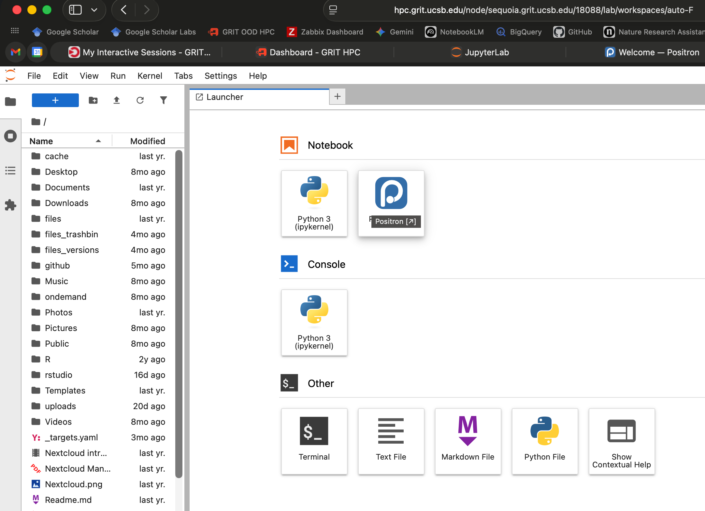

# Using sequoia

Sequoia leverages Open OnDemand (OOD), a system managed by GRIT to
connect our HPC resources to commonly used software. OOD is accessed via
an online dashboard in your web browser: <https://hpc.grit.ucsb.edu>

Once at the website, you can use your GRIT user ID and password. The
system does not require you to be on campus or use a VPN.

Through OOD, you can use the following software:

-   R Studio Server
-   Positron Server
-   Jupyter Notebook
-   VS Code Server

To use any of these, click "Interactive Apps", then click on your
software of choice. Note that Positron Server is technically accessed *through* Jupyter Notebooks;
so to start a Positron Server session, click "Jupyter Notebook".

Each time you launch an interactive app, you need to specify the following up-front
before launching the job:

-   Partition name: Type `emlab_nodes` to use emLab's private sequoia
    resources (this should be used in most cases). Alternatively, you
    can type `grit_nodes` to use GRIT's campus-wide shared resources
    (note however that Positron Server is only available when using `emlab_nodes`,
    since we have a special license from Posit)

-   Job duration (up to 168 hours): Your interactive session will run
    for this amount of time, and then shut down (you can cancel jobs
    before the ending time if you desire)

-   Number of cores: How many CPU cores you want to use for your
    interactive session. Currently, we have this set to a maximum of 24
    cores per session. Since sequoia is a shared resource, please be
    considerate of others when requesting cores. If you are unsure of
    how many cores to use, see [Best practices and resource allocation](best-practices-and-resource-allocation.qmd)
    to help you figure this out.

-   RAM: How much RAM you want to use for your interactive session.
    Currently, we have this set to a maximum of 256GB per session. Since
    sequoia is a shared resource, please be considerate of others when
    requesting cores. If you are unsure of how much RAM to use, see
    [Best practices and resource allocation](best-practices-and-resource-allocation.qmd)
    to help you figure this out.

Please do not enable to "Use GPU" option unless you have already
discussed this with Kathy or Robert (it is only available on quebracho
for land use projects at this time).

Note that for convenience, your last used settings will be saved for the
next time you launch an interactive app.

Once you've configured your session, click "Launch". It may take a few
minutes for your session to start up. Once it is ready, you will see a
link to open whichever interactive app you selected. Click the
link to open the app in a new browser tab.

 If you wish to use Positron Server,
click the link for your Jupyter Notebook session; once this starts, you will see a link
in the upper-right corner of the session for Positron under `Notebook`. Click this to launch Positron Server.

Note that you may use OOD to launch *multiple* interactive sessions at
the same time! They are each still managed through SLURM.

More resources for OOD are available on GRIT's bookstack:

-   [OOD landing
    page](https://bookstack.grit.ucsb.edu/books/hpc-usage/chapter/openondemand-ood)

-   [R Studio
    Server](https://bookstack.grit.ucsb.edu/books/hpc-usage/page/r-studio)

-   [Jupyter
    Notebook](https://bookstack.grit.ucsb.edu/books/hpc-usage/page/jupyter-notebook)

-   [VS Code
    Server](https://bookstack.grit.ucsb.edu/books/hpc-usage/page/vs-code-server)
