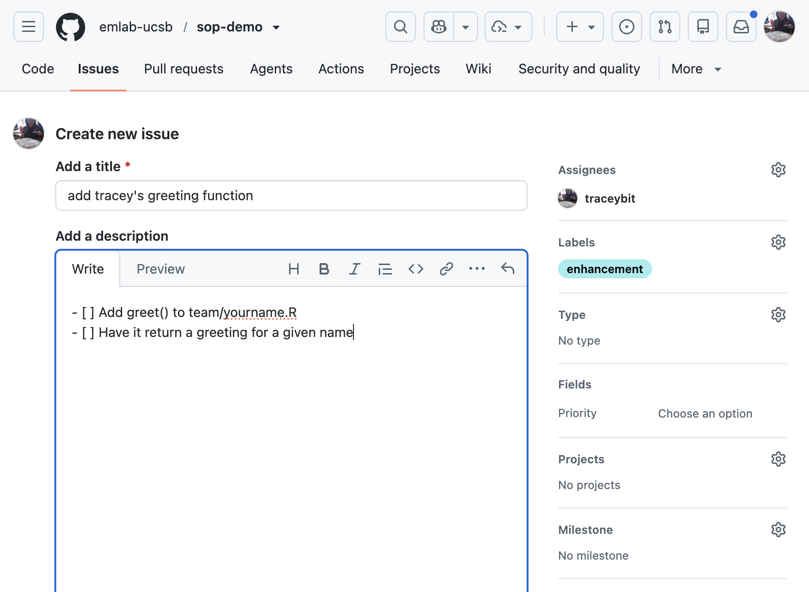
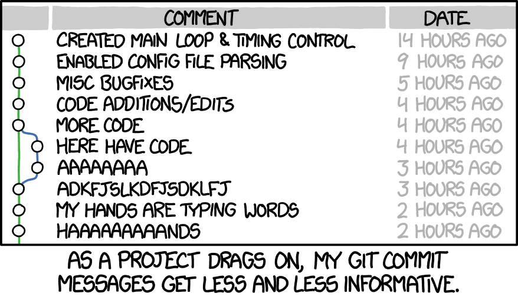
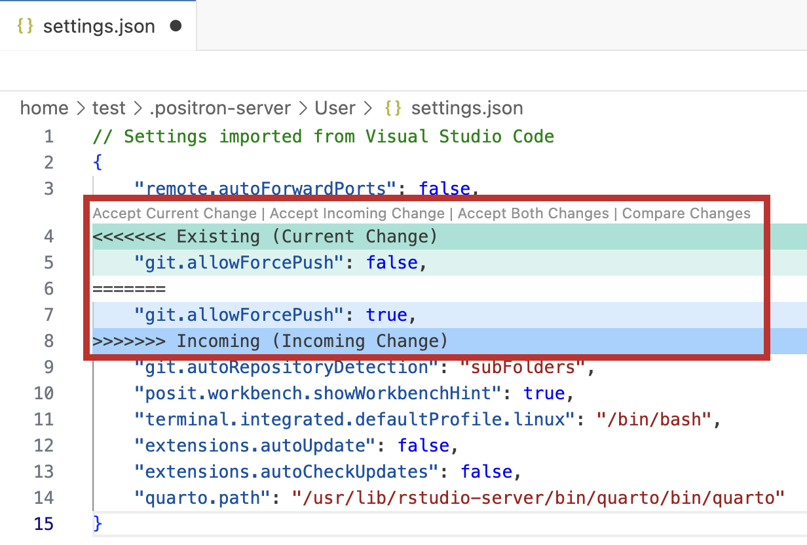
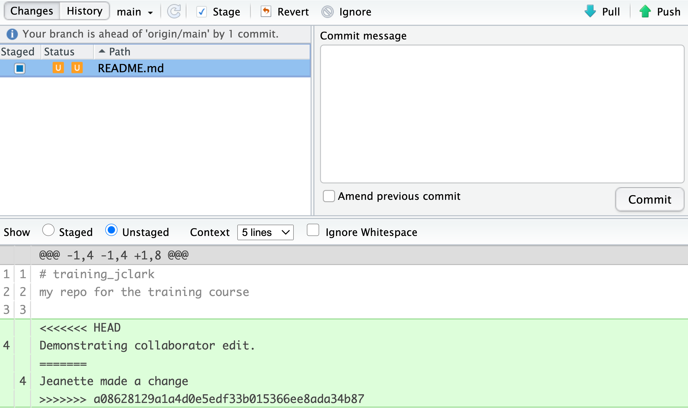

## How this demo works

We'll move between **these slides** and **live coding**.

::: {.panel}
- The slides contain **instructions** for live-coding.
- Tools: **github.com**, **Positron**, **RStudio**, **terminal**.
- Everyone using the **same shared practice repo** today.
:::

By the end you'll have practiced these actions:

- branch
- commit
- open a PR
- review a PR
- merge
- work with issues
- resolve a merge conflict

::: {.notes}
Set expectations: this is hands-on. Tell people to keep the slides open in one
window and their IDE in another. Confirm everyone has been added to the shared
repo and can see it on github.com before starting.
:::

## Reading the slides {.smaller}

Every interactive slide tells you **who acts** and **where**.

**Who:**

- [WATCH]{.badge-watch} — Presenters do this live; everyone watches.
- [EVERYONE]{.badge-everyone} — do this now, on your own machine.

**Where:**

- [github.com]{.tool-gh}  [Positron]{.tool-pos}  [RStudio]{.tool-rs}  [VS Code]{.tool-vs}  [Terminal]{.tool-term}

::: {.panel}
**Several tools, one workflow.** Most people use **Positron** or **RStudio**;
every git step can also be done from the **terminal**. We show the options where
they differ.
:::

## Today's roadmap {.smaller .tight}

1. Protect `main` with a ruleset  [WATCH]{.badge-watch}
2. Clone the repo & try pushing to `main`  [EVERYONE]{.badge-everyone}
3. Set up the **Air** formatter  [EVERYONE]{.badge-everyone}
4. Create an **issue**, then **branch from it**  [EVERYONE]{.badge-everyone}
5. Make a change → **commit** → **push**  [EVERYONE]{.badge-everyone}
6. Open a **pull request** & assign a reviewer  [EVERYONE]{.badge-everyone}
7. **Code review:** request changes → revise → approve → merge (closes issue) → delete [EVERYONE]{.badge-everyone}
8. **Merge conflict** — create one on purpose, then resolve it [EVERYONE]{.badge-everyone}

# 1 · Protect `main` {.divider}

Watch setup. You'll feel it later when a direct push to `main` is refused.

## Create a branch ruleset {.smaller}

::: {.where}
[WATCH]{.badge-watch} &nbsp; [github.com]{.tool-gh} &nbsp; Settings → Rules → Rulesets
:::

Repo: **Settings → Rules → Rulesets → New ruleset → New branch ruleset**.

- **Name ruleset:** `protect-main`
- **Enable status:** `Active`
- **Bypass list (optional):** who may skip the rule 
- **Target branches:** add target → `Default` (or pattern `~DEFAULT_BRANCH`)
- **Rules — turn on:**
  - **Restrict deletions**
  - **Require a pull request before merging**
    - Require **0** approvals: You can merge your own PR
    - Require **1** approval: Someone else must approve 
  - **Block force pushes**

::: {.panel}
emLab **recommends** protecting `main` —
it's not strictly required, but it's best practice and we'll use it today.
:::

::: {.notes}
Optionally show the Copilot code review toggle under Settings → Copilot, and
mention it's a useful first pass but does not replace human review. Keep the
bypass list empty for the demo so everyone hits the protection.
:::

# 2 · Clone the repo {.divider}

Everyone gets a local copy of the shared repo and links it to GitHub.

## Copy the repo URL

::: {.where}
[EVERYONE]{.badge-everyone} &nbsp; [github.com]{.tool-gh}
:::

Navigate to our shared repo: 

[github.com/emlab-ucsb/sop-demo](github.com/emlab-ucsb/sop-demo)

Click the green **Code** button:

- **HTTPS** tab if you authenticate with a Personal Access Token (PAT)
- **SSH** tab if you set up SSH keys

Copy the URL with the copy icon.

```
# HTTPS
https://github.com/emlab-ucsb/sop-demo.git
# SSH
git@github.com:emlab-ucsb/sop-demo.git
```

::: {.notes}
If anyone isn't authenticated yet, point them to the SOP "Getting set up" page
(PAT via usethis::create_github_token(), then gitcreds::gitcreds_set()). Have a
backup plan for people who get stuck so the group isn't blocked.
:::

## Clone it locally {.smaller}

::: {.where}
[EVERYONE]{.badge-everyone} &nbsp; [Positron]{.tool-pos} / [RStudio]{.tool-rs} / [Terminal]{.tool-term}
:::

::: {.columns}
::: {.column width="33%"}
**Positron/VS Code**

`File → New Folder from Git…`

Paste the URL, pick a destination (e.g. `~/github/`), click **OK**.
:::
::: {.column width="33%"}
**RStudio**

`File → New Project… → Version Control → Git`

Paste the URL, choose where to store it, **Create Project**.
:::
::: {.column width="34%"}
**Terminal**

```bash
cd ~/github
git clone <paste-url>
cd REPO-NAME
```
:::
:::

::: {.panel}
Store repos in a dedicated folder like `~/github/`. **Avoid** cloud-synced
folders (Google Drive, iCloud, Dropbox) — they cause Git sync conflicts.
:::

## Try pushing to `main` {.smaller}

::: {.where}
[EVERYONE]{.badge-everyone} &nbsp; [Positron]{.tool-pos} / [RStudio]{.tool-rs} / [Terminal]{.tool-term}
:::

Make a small change directly on `main`, commit it,
and try to push — it should be **refused**.

- **Positron/ VS Code / RStudio:** edit any file → **stage + commit** → **push / sync**.

The push is **rejected**:

```
remote: error: GH013: Repository rule violations found for refs/heads/main.
```

That's the protection working. Nothing reaches `main` without a PR.

::: {.panel}
**Undo the test commit** — it's only on your machine (the push failed). Reset
your local `main` to match GitHub:

- **Terminal:** `git reset --hard origin/main`
- **Positron / VS Code:** `Cmd+Shift+P` → **Git: Undo Last Commit**, then
  **Discard Changes** on the file in the Source Control panel.
:::

# 3 · Set up the Air formatter {.divider}

Formatting with **Air** (R) is an emLab standard. Set it up once. We'll see it
work in Section 5.

## Install Air — Positron / VS Code {.smaller}

::: {.where}
[EVERYONE]{.badge-everyone} &nbsp; [Positron]{.tool-pos} / [VS Code]{.tool-vs}
:::

1. Extensions (`Cmd+Shift+X`) → search **"Air"** (by Posit) → Install.
2. Open user settings JSON (`Cmd+Shift+P` → *Open User Settings (JSON)*) and add:

```json
{
  "[r]": {
    "editor.defaultFormatter": "posit.air",
    "editor.formatOnSave": true
  }
}
```

**Note:** You can enable or disable Air per-workspace, and turn formatting off later
by setting `"editor.formatOnSave": false`.
Useful when editing an unformatted file, to avoid a whole-file diff.

::: {.panel}
We'll watch Air reformat code on save when we make our first change in
Section 5 — no need to test it now.
:::

## Install Air — RStudio {.smaller}

::: {.where}
[EVERYONE]{.badge-everyone} &nbsp; [RStudio]{.tool-rs}
:::

Air isn't tightly integrated with RStudio. Use the `styler` package instead:

```r
install.packages("styler")
```

Then **Addins → Style active file** before each commit, and enable
*Tools → Global Options → Code → Saving → Ensure source files end with a
newline*.

# 4 · Issue → branch {.divider}

Issues track work alongside the code. We'll create one, then branch directly
from it so the branch and PR are linked to the issue.

## Create & triage an issue {.smaller}

::: {.where}
[EVERYONE]{.badge-everyone} &nbsp; [github.com]{.tool-gh} &nbsp; Issues → New issue
:::

Create an issue for the small task you'll do today:

{fig-align="center"}

- **Title:** *"Add [name]'s greeting function"*
- **Body:** what & why, plus a checklist:
  ```markdown
  - [ ] Add greet() to team/yourname.R
  - [ ] Have it return a greeting for a given name
  ```
- **Sidebar:** set an **Assignee** (yourself), a **Label** (`enhancement`),
  and optionally a **Milestone**.

::: {.notes}
Show how the checklist renders as interactive checkboxes and shows "0 of 2" in
the issue list, and that labels make the list filterable.
:::

## Create a branch from the issue {.smaller}

::: {.where}
[EVERYONE]{.badge-everyone} &nbsp; [github.com]{.tool-gh} → [Positron]{.tool-pos} / [RStudio]{.tool-rs} / [Terminal]{.tool-term}
:::

On your issue, in the **Development** section (right sidebar) → **Create a
branch**. Keep or change the suggested name — either way the branch is linked
to the issue.
<br>
<br>
Now get that branch onto your machine:

- **Positron / VS Code / RStudio:** click the branch picker → **fetch/refresh**,
  then **switch** to the new branch.
- **Terminal:**

```bash
git fetch
git switch <issue-branch-name>
```

::: {.panel}
Creating the branch from the issue links them: branch activity shows in the
issue timeline, and the issue will close automatically when the PR merges.
:::

# 5 · Change → commit → push {.divider}

Make a small change on your branch, commit it, and push it to GitHub.

## Make a change {.smaller}

::: {.where}
[EVERYONE]{.badge-everyone} &nbsp; [Positron]{.tool-pos} / [RStudio]{.tool-rs}
:::

Create a new file **named after you** so we don't overlap — e.g.
`team/yourname.R`:
<br>
<br>
```r
# team/tracey.R
greet <- function(name) {
  paste0("The best state in the nation, 
  New 
  Jersey, 
  welcomes you, ", name)
}

greet("Danielle")
```
<br>
<br>
Type it messily first (no spaces, odd indents), then **save** and watch **Air**
reformat it to Tidyverse style.

::: {.panel}
Working in your own file avoids accidental conflicts. We'll create a conflict
*on purpose* later in a shared file to demonstrate how to resolve it.
:::

## Commit your work {.smaller}

::: {.where}
[EVERYONE]{.badge-everyone} &nbsp; [Positron]{.tool-pos} / [RStudio]{.tool-rs} (or [Terminal]{.tool-term})
:::

In **Source Control** panel (Positron/VS Code) or **Git** pane (RStudio):

1. **Stage** `team/yourname.R` (click the **+** next to the file).
2. Type a clear commit **message**.
3. Click **Commit**.

{width="520" fig-align="center"}

::: {.caption}
Write messages your future self can read. Source: xkcd.com/1296
:::

Prefer the terminal?

```bash
git add team/yourname.R
git commit -m "Add Tracey's greeting function"
```

## Push your branch to GitHub {.smaller}

::: {.where}
[EVERYONE]{.badge-everyone} &nbsp; [Positron]{.tool-pos} / [RStudio]{.tool-rs} (or [Terminal]{.tool-term})
:::

- **Positron / VS Code:** click the **sync** arrows in the Source Control panel.
- **RStudio:** click the **Push** (green up-arrow) in the Git pane.

Prefer the terminal?

```bash
git push
```

## Branches can be created several ways {.smaller}


You can create a branch from:

- **github.com** — from an **issue** (links it to the issue, like today), or the
  **Branches** page → **New branch**.
- **Positron / VS Code** — branch picker (bottom-left) → **Create new branch…**.
- **RStudio** — Git pane → **New Branch**.
- **Terminal** — `git switch -c your-branch`.

::: {.panel}
**The difference:** a branch made **on GitHub** already exists remotely, so you
just **push / sync**. A branch made **locally** (IDE or terminal) needs a first
**Publish Branch** / `git push -u` to create it on GitHub.
:::

# 6 · Open a pull request {.divider}

Propose your branch for merging into `main` and ask your
partner to review it.

## Open the PR {.smaller}

::: {.where}
[EVERYONE]{.badge-everyone} &nbsp; [github.com]{.tool-gh}
:::

After pushing, GitHub shows a **"Compare & pull request"** banner — click it
(or **Pull requests → New pull request**).

- **Base:** `main`  ·  **Compare:** your branch
- **Title:** summarize the change: *"Add greeting function"*
- **Description:** what it does and why, plus **`Closes #<issue-number>`**.

::: {.panel}
Branching from the issue *links* the two. In most cases, **closing a PR linked to an issue will also close the issue when the PR merges** by default. You can also use the **`Closes #N`** or **`Fixes #N`** keywords to do so. One PR can close several issues:
`Closes #12, closes #15`.
:::

Press **Create pull request**. The PR is now open for review.


## Assign your reviewer {.smaller}

::: {.where}
[EVERYONE]{.badge-everyone} &nbsp; [github.com]{.tool-gh}
:::

**Pair up: A reviews B, and B reviews A.**

In your PR's right sidebar → **Reviewers** → choose your partner. Our ruleset
requires **1 approval** before the PR can merge, so your partner's review is
what unblocks the merge.

::: {.panel}
*(Optional: **Assignees** marks who owns/will merge the PR — you can assign
yourself. The important one today is **Reviewer** = your partner.)*
:::

::: {.notes}
Make sure pairs are set before moving on — the review sections all depend on each
person having their partner assigned as reviewer on an open PR.
:::

## What a reviewer is actually doing {.smaller}

::: {.where}
Concept — applies to every review
:::

GitHub gives three review outcomes:

- **Comment** — feedback, no decision.
- **Approve** — ready to merge.
- **Request changes** — specific things must be fixed first.

::: {.panel .tight}
Good review habits (from the emLab Code Review SOP):

- Be **specific and constructive** — suggest a fix, don't just flag.
- Mark **"Required:"** vs **"Suggestion:"/"Nit:"** so priorities are clear.
- Prioritize **correctness** over style.
- For accuracy/reproducibility, **actually run the code**.
- Be **timely** — a stale PR blocks your partner.
:::

# Code review {.divider}

Reviewer **requests changes** → author **revises** → reviewer **approves** →
**merge** → **delete branch**.

## Reviewer requests changes {.smaller}

::: {.where}
[EVERYONE]{.badge-everyone} (as reviewer) &nbsp; [github.com]{.tool-gh}
:::

Open your **partner's** PR → **Files changed** tab.

- Hover a line → click the blue **+** → leave a **line comment**, for example:
  - *"Required: make the greeting friendlier — e.g., add an exclamation point."*
- Click **Submit review** → **Request changes** → **Submit review**.

{width="280" fig-align="center"}

::: {.panel}
"Request changes" blocks the merge until you re-review — use it when you want
another look before it can merge.
:::

## You can also review in your IDE {.smaller}

::: {.where}
Good to know — [Positron]{.tool-pos} / [VS Code]{.tool-vs} / [RStudio]{.tool-rs}
:::

Switch to the PR branch locally and **run the code** — often the only way to
catch real errors.

::: {.panel}
Positron / VS Code's **GitHub Pull Requests** extension even lets you check out
a PR, comment, and approve without leaving the editor.
:::


## Reviewer re-reviews & approves {.smaller}

::: {.where}
[EVERYONE]{.badge-everyone} (as reviewer) &nbsp; [github.com]{.tool-gh}
:::

Re-open your partner's PR and look at the new commits in **Files changed**.

For a **tiny** fix, you can also just make the change yourself:

- **Files changed** → click the **pencil ✏️** → edit → **Commit changes** to the
  PR's branch.

When the changes look good: **Review changes → Approve → Submit**.

::: {.panel}
Talk with your team about when reviewers should edit directly. For anything
substantial, leave a comment so the **author** makes the change and keeps
ownership.
:::

## Author merges {.smaller}

::: {.where}
[EVERYONE]{.badge-everyone} (as author) &nbsp; [github.com]{.tool-gh}
:::

Once approved, the green **Merge pull request** is enabled. 
<br>
<br>
Choose a merge strategy from the dropdown menu → click **Merge pull request** → **Confirm merge**. 

::: {.panel}
**Three merge strategies** (the dropdown on the merge button):

- **Create a merge commit** *(default)* — keeps every branch commit plus a merge
  commit; full history.
- **Squash and merge** — combines all the branch's commits into one on `main`;
  tidy history, handy for messy or exploratory branches.
- **Rebase and merge** — replays the branch's commits onto `main` with no merge
  commit; linear history.
:::

Because your PR said **`Closes #N`**, merging it **auto-closes your issue** —
check the Issues tab to confirm.

## Delete the merged branch {.smaller}

::: {.where}
[EVERYONE]{.badge-everyone} &nbsp; [github.com]{.tool-gh} (+ IDE)
:::

Right after merging, GitHub shows **Delete branch** — click it. This deletes the
branch **on GitHub** (the remote copy).

Now clean up on your machine:

1. **Switch to `main` and pull** — Positron/VS Code/RStudio: pick `main` in the branch
   picker, click **pull/sync**. This brings the merged work down.
2. **Delete your local branch** — it still exists locally until you remove it:
   - **Positron / VS Code:** `Cmd+Shift+P` → **Git: Delete Branch…** → pick it.
   - **RStudio / Terminal:** `git branch -d <your-branch>`

::: {.panel}
There are always **two copies** of a branch — remote (GitHub) and local (your
machine). Deleting one doesn't delete the other.
:::

## Talk to your collaborators {.smaller}

**Communication is the most important code review tool.** On your project team, agree on the code review conventions up front.

- **Who merges** — author after approval, or the reviewer?
- **When a reviewer edits directly** vs. just leaving comments.
- **How many approvals**, and **who reviews whom**.
- **How fast** reviews happen, so PRs don't go stale.
- **Branch/PR scope** before review.
- **Who's touching what**, so two people don't clash on a file.

::: {.panel}
No single right answer — what matters is the team **decides and writes it down**
(in a `README.md` or similar).
:::

# 7 · Merge conflicts {.divider}

Two changes to the **same line** can't auto-merge. Let's create one on purpose,
then resolve it using the IDE and github.com.

## Set up a conflict — with your partner {.smaller}

::: {.where}
[EVERYONE]{.badge-everyone} (in your pairs) &nbsp; [github.com]{.tool-gh}
:::

A conflict happens when **multiple people change the same line**. You'll create one
on purpose with your partner a **shared file** (e.g. `sop-demo/conflict-files/partners-1.R`).

It will take three steps:

1. Both partners branch from the `main`.
2. **Partner A** edits a file and merges it to `main`.
3. **Partner B** edits the same line in the same file on their branch and creates a PR — this will trigger a conflict.

First, each pair will be assigned to a file in the `conflict-files` folder.

Next, decide who is Partner A and who is Partner B.

::: {.notes}
Partner A merges before Partner B opens their PR. Then swap roles so everyone
resolves one.
:::

## Conflict: Step 1 — both branch from `main` {.smaller}

::: {.where}
[EVERYONE]{.badge-everyone} (in your pairs) &nbsp; [Positron]{.tool-pos} / [RStudio]{.tool-rs}
:::

**Both partners:** Make sure `main` is up to date first:

- **Positron / VS Code / RStudio:** switch to `main` in the branch picker → **pull / sync**.
- **Terminal:** `git switch main && git pull`.

**Both partners:** Create your **own** branch from the main (A and B on separate branches).

## Conflict: Step 2 — Partner A edits and merges to main {.smaller}

::: {.where}
[EVERYONE]{.badge-everyone} (in your pairs) &nbsp; [Positron]{.tool-pos} → [github.com]{.tool-gh}
:::

Partner A edits their assigned file. Partner B should **not** edit it yet, but prepare for Partner A's PR.:

1. **Partner A:** edit the file → commit → push → PR  
2. **Partner B:** review and mentally note a line that has changed → approve
3. **Partner A:** merge to `main`.

## Conflict: Step 3 — Partner B edits and opens a PR {.smaller}

Partner B, **within their branch**:

1. Edit the **same line** in the **same file**, commit, and push branch
2. Open PR. GitHub will indicate a **merge conflict** and **block the merge** until it's resolved.

## Resolve conflict on github.com {.smaller}

::: {.where}
[EVERYONE]{.badge-everyone} &nbsp; [github.com]{.tool-gh}
:::

Click **Resolve conflicts** to open the web editor:

{width="820" fig-align="center" .nostretch}

```r
<<<<<<< your-branch-name
  paste0("I went on a ", activity, " — best summer!")
=======
  paste0("I went on one ", activity, ", it's summer!")
>>>>>>> main
```

Options:

- Use buttons to choose version to keep.
- Manually delete the `<<<<<<<`, `=======`, `>>>>>>>` markers, keeping the correct line.

**Mark as resolved → Commit merge**. The PR is now mergeable.

::: {.panel}
GitHub labels the sides with the **branch names** (top = your branch, bottom =
`main`).
:::

## Resolve it in Positron / VS Code {.smaller}

::: {.where}
Alternative — [Positron]{.tool-pos} / [VS Code]{.tool-vs}
:::

After `Git: Merge Branch…`, the conflicted file opens in the **merge editor**:

- **Accept Current Change** — your branch's version.
- **Accept Incoming Change** — the version from `main`.
- **Accept Both** — keep both, in order.

Then **save**, **stage**, **commit**, **push**.

{width="380" fig-align="center" .nostretch}

::: {.caption}
Image: [Posit Positron docs](https://docs.posit.co/ide/server-pro/user/positron/guide/settings.html)
:::

## Resolve it in RStudio {.smaller}

::: {.where}
Alternative — [RStudio]{.tool-rs}
:::

RStudio has no merge editor — the conflicted file just shows the **raw markers**.
Edit them by hand, then **stage** and **commit** in the Git pane.

{width="620" fig-align="center"}

::: {.caption}
Image: [NCEAS coreR](https://learning.nceas.ucsb.edu/2023-04-coreR/session_10.html)
:::

::: {.panel}
The top (`HEAD`) is **your branch**; the bottom is the **incoming** version.
Delete the `<<<<<<<` / `=======` / `>>>>>>>` lines and whichever version you
don't want.
:::

More on conflicts in RStudio:
[NCEAS coreR — Collaborating with Git](https://learning.nceas.ucsb.edu/2023-04-coreR/session_10.html)

## Keep your branch up to date with `main` {.smaller}

::: {.where}
[EVERYONE]{.badge-everyone} — do this regularly, *not* just when there's a conflict
:::

Pull `main` into your branch **often** — the longer it drifts, the harder the
merge.

::: {.panel}
**Watch out:** **Pull / Sync** only updates your *current* branch — it does
**not** pull in `main`'s new commits. For that you must **merge `main` in**.
:::

How (with `main` already pulled):

- **Positron / VS Code:** `Cmd+Shift+P` → **Git: Merge Branch…** → pick `main`.
- **Terminal:** `git switch your-branch`, then `git merge main`.

Also: small, focused branches and PRs, and coordinate on shared files.

# Recap {.divider}

## What you did today {.smaller .tight}

- ✅ Protected `main` with a **ruleset** (PR + 1 review)
- ✅ **Cloned** the shared repo
- ✅ Set up the **Air** formatter (format on save)
- ✅ Created an **issue**, then **branched from it**
- ✅ Made a change, **committed**, and **pushed** (from the IDE)
- ✅ Opened a **PR** and assigned a **reviewer**
- ✅ **Reviewed code:** requested changes → revised → approved → merged (**closed the issue**) → deleted
- ✅ Created and **resolved a merge conflict**

::: {.panel}
This is the everyday emLab workflow: code reaches `main` through branch-based
tasks, pull requests, and review.
:::

## Where to go next

::: {.panel}
The full **emLab Standard Operating Procedures** cover all of this in depth:
:::

- **Getting set up** — git install, PAT/SSH, joining the org
- **Working with branches, pull requests, using issues, and rulesets**
- **Code review** — planning, standards, and best practices
- **Code styling** — Air & Ruff setup

📖 [emlab-ucsb.github.io/SOP](https://emlab-ucsb.github.io/SOP/)

### Questions?

::: {.notes}
Leave time for Q&A. Point people back to the SOP for anything they want to
revisit, and remind them the workflow is the same on every emLab project repo.
:::
